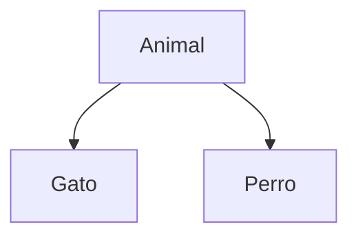
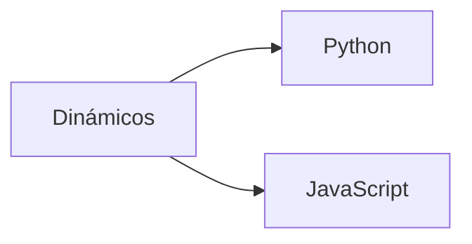
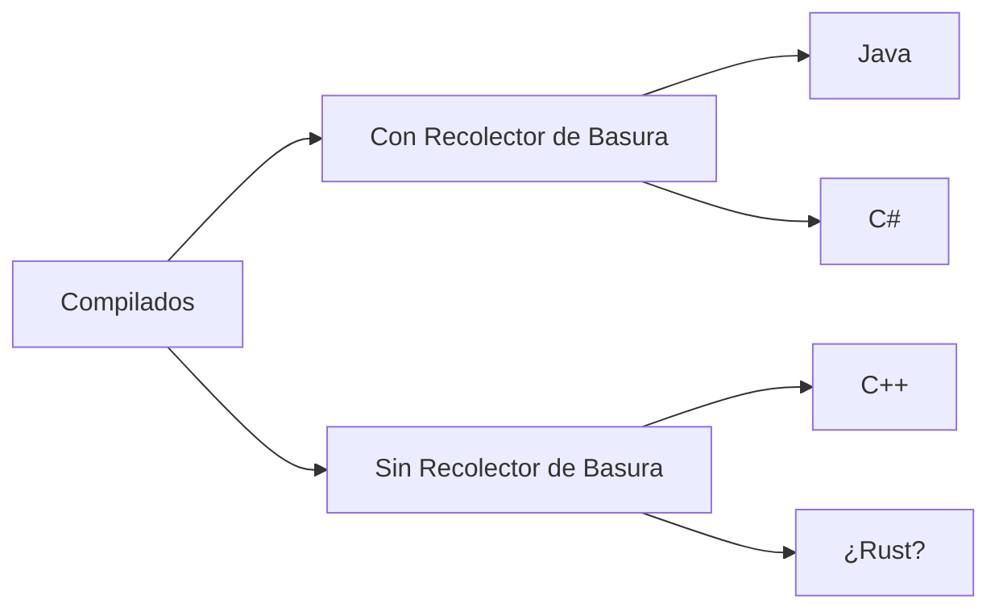
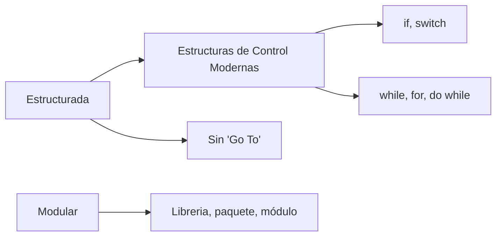
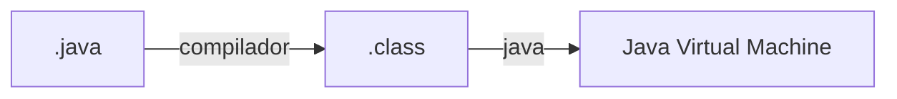
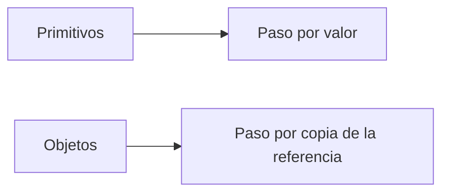

<!--
Posible prompt:
<prompt>
Tengo un cuestionario con preguntas sobre "Clases y Objetos". Debes tener en cuenta que los conocimientos previos que tengo (y por tanto tus respuestas deben ser adaptadas), son:
- C/C++ sin orientación a objetos.
- Temas de Java previos: ninguno.

Cada respuesta debe tener entre 2 - 4 párrafos de longitud (sin contar los trozos de código).

Por favor, escribe en impersonal las respuestas.

</prompt>
----
-->

# TEMA 1. Clases y objetos

## 1. ¿Cuáles son las cuatro características básicas de la programación orientada a objetos? Describe brevemente cada una

Abstracción
: "Olvidar detalles"
* Tratar temas complejos
* Facilitar el cambio
---
Encapsulación
: Unir estado-comportamiento
Ocultar partes

---
Herencia
: Establecer jerarquias
 Ejemplo:

* "Gato" y "Perro" comparten la misma clase Animal
* Animal tiene la funcion dormir, "Gato" y "Perro" pueden dormir
* "Gato" y "Perro" pueden tener otras funciones (ejemplo: maullar, ladrar)
---
Polimorfismo
: Misma función, distintas formas de implementarlo
* Ej: cada animal duerme de distinta forma (dormir es la función)

## 2. Cita cuatro lenguajes populares que permitan la programación orientada a objetos



Lenguaje Compilado
: Con comprobación estática de tipos

## 3. Los paradigmas anteriores a la POO, ¿Qué es la **programación estructurada**? y, todavía mejor, ¿Qué es la **programación modular**?


Modular
: Agrupa código para facilitar su uso en otros programas

## 4. ¿Qué tres elementos definen a un objeto en programación orientada a objetos?

Identidad
: Dirección de Memoria

---
Estado
: Atributos (equivalente a los campos en un struct)

---
Comportamiento
: Metodos (funciones que todos los objetos de esa clase pueden hacer)

## 5. ¿Qué es una clase? ¿Es lo mismo que un objeto? ¿Qué es una instancia? ¿Todos los lenguajes orientados a objetos manejan el concepto de clase?

Clase
: Molde para crear instancias durante la ejecución
Define la estructura del estado y el comportamiento
(struct con esteroides)

---
Objeto
: Variable de tipo alguna clase con un estado concreto de sus atributos

## 6. ¿Dónde se almacenan en memoria los objetos? ¿Es igual en todos los lenguajes? ¿Qué es la **recolección de basura**? 

* Los objetos se almacenan en el Heap en la mayoria de lenguajes, otros permiten ambas (Heap y Stack)

Ventajas
: Memoria dinámica
Va más allá del metodo donde fue creado

---
Desventajas
: Hay que liberarla (manual / recolector de basura)


## 7. ¿Qué es un método? ¿Qué es la **sobrecarga de métodos**? 

```java
    class Calculadora{
        int sumar(int a, int b){
            return a + b;
        }
        double sumar(double a, double b){
            return a + b;
        }
    }
    main(){
        Calculadora miCalculadora = new Calculadora();
        int res = miCalculadora.sumar(3, 5);
        double res2 = miCalculadora.sumar(3.7, 5.4);
    }
```


## 8. Ejemplo mínimo de clase en Java, que se llame Punto, con dos atributos, x e y, con un método que se llame `calculaDistanciaAOrigen`, que calcule la distancia a la posición 0,0. Por sencillez, los atributos deben tener visibilidad por defecto. Crea además un ejemplo de uso con una instancia y uso del método

```c++
//C++
struct Punto{
    int x;
    int y;
}
double calcularDistanciaAOrigen(struct Punto punto){
    return sqrt(punto.x * punto.x + punto.y * punto.y);
}
int main(){
    Punto miPunto;
    miPunto.x = 5;
    miPunto.y = 6;
    double aOrigen = calcularDist;
}
```
```java
//Java
class Punto{
    int x;
    int y;
    double calcularDistanciaAOrigen(){
        return sqrt(x * x + y * y);
    }
}
public class Ejercicio1{
    public static void main(String [] args){
        Punto miPunto = new Punto();
        miPunto.x = 5;
        miPunto.y = 6;
        double aOrigen = miPunto.calcularDistanciaAOrigen();
    }
}
```


## 9. ¿Cuál es el punto de entrada en un programa en Java? ¿Qué es `static` y para qué vale? ¿Sólo se emplea para ese método `main`? ¿Para qué se combina con `final`?

```java
    class Ejercicio1{
        public static void main(String [] args){

        }
    }
```
Static
: Dice que el atributo o metodo pertenece a la clase
No necesita un objeto para usarse(desde fuera se usa el nombre de la clase)
No existe 'this'
Desde 'static' solo puede usarse otro 'static'

## 10. Intenta ejecutar un poco de Java de forma básica, con los comandos `javac` y `java`. ¿Cómo podemos compilar el programa y ejecutarlo desde linea de comandos? ¿Java es compilado? ¿Qué es la **máquina virtual**? ¿Qué es el *byte-code* y los ficheros `.class`?


Ventaja
: Portabilidad

---
Desventaja
: Rendimiento


## 11. En el código anterior de la clase `Punto` ¿Qué es `new`? ¿Qué es un **constructor**? Pon un ejemplo de constructor en una clase `Empleado` que tenga DNI, nombre y apellidos

New
: Reserva memoria
Invoca contructor
Es una expresion (asignar a una variable o usar directamente)


## 12. ¿Qué es la referencia `this`? ¿Se llama igual en todos los lenguajes? Pon un ejemplo del uso de `this` en la clase `Punto`

This
: Referencia al objeto actual
Sirve para aclarar/desambiguar
No disponible en 'static'
Otro nombre en otros lenguajes ('self' en Python)


## 13. Añade ahora otro nuevo método que se llame `distanciaA`, que reciba un `Punto` como parámetro y calcule la distancia entre `this` y el punto proporcionado

### Respuesta


## 14. El paso del `Punto` como parámetro a un método, es **por copia** o **por referencia**, es decir, si se cambia el valor de algún atributo del punto pasado como parámetro, dichos cambios afectan al objeto fuera del método? ¿Qué ocurre si en vez de un `Punto`, se recibiese un entero (`int`) y dicho entero se modificase dentro de la función? 




## 15. ¿Qué es el método `toString()` en Java? ¿Existe en otros lenguajes? Pon un ejemplo de `toString()` en la clase `Punto` en Java

### Respuesta


## 16. Reflexiona: ¿una clase es como un `struct` en C? ¿Qué le falta al `struct` para ser como una clase y las variables de ese tipo ser instancias?


### Respuesta


## 17. Quitemos un poco de magia a todo esto: ¿Como se podría “emular”, con `struct` en C, la clase `Punto`, con su función para calcular la distancia al origen? ¿Qué ha pasado con `this`?

### Respuesta
