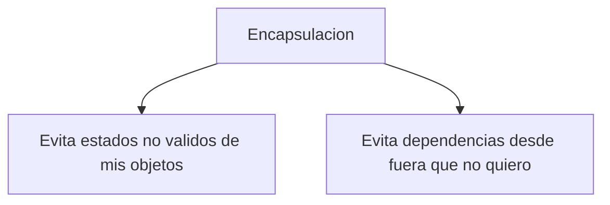
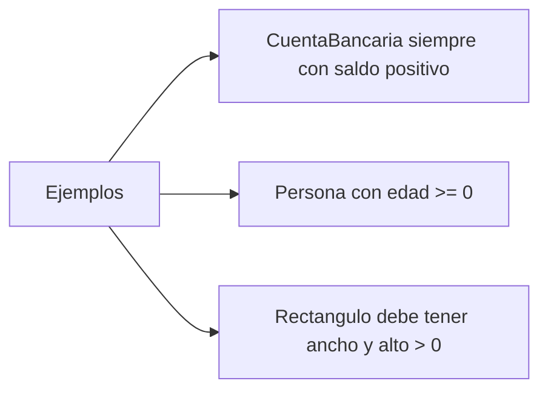

<!--
Posible prompt:
<prompt>
Tengo un cuestionario con preguntas sobre "Encapsulación". Debes tener en cuenta que los conocimientos previos que tengo (y por tanto tus respuestas deben ser adaptadas), son:
- C/C++ sin orientación a objetos.
- Temas de Java previos: Clases y Objetos.

Cada respuesta debe tener entre 2 - 4 párrafos de longitud (sin contar los trozos de código).

Por favor, escribe en impersonal las respuestas.

</prompt>
----
-->
# TEMA 2. Encapsulación

## 1. En Programación Orientada a Objetos (POO), ¿Qué buscan la **encapsulación** y **la ocultación** de información? Enumera brevemente algunas ventajas de la ocultación de información.

Encapsulacion
: Relacionado con la proteccion


Ocultacion
: He juntado estado y comportamiento en un artefacto (la clase), y ahora puedo ocultar ciertas partes del exterior


## 2. ¿Qué se entiende por la **interfaz pública** de un objeto o clase en POO? Describe brevemente cómo se relaciona con la ocultación de información.

Interfaz pública
: Los miembros que se ven desde fuera, es decir, que no están ocultos


## 3. Brevemente: ¿Por qué hay que ser conscientes y diseñar con cuidado la **interfaz pública** de una clase? ¿Es fácil cambiarla?

La interfaz publica si se cambia tiene mas consecuencias que cualquier cambio en la parte oculta


## 4. ¿Qué son las **invariantes de clase** y por qué la ocultación de información nos ayuda?

Invariantes de clase
: Condiciones que los objetos de esa clase deben cumplir siempre para ser válidos en todo momento que exista el objeto




## 5. Pon un ejemplo de una clase `Punto` en `Java`, con dos coordenadas, `x` e `y`, de tipo `double`, con un método `calcularDistanciaAOrigen`, y que haga uso de la ocultación de información. ¿Cuál es la interfaz pública de la clase `Punto`? ¿Qué significa `public` y `private`?

```java
class Punto{
    private double x;
    private double y;
}
public Punto(double x, double y){ //Desde aqui es interfaz publica
    this.x = x;
    this.y = y;
}
double distanciaAOrigen(){ // Menos visible que 'public' pero mas que 'private'
// Usable solo en el paquete
    return Math.sqrt(this.x * this.x + this.y * this.y)
}
```
public
: Se puede usar desde cualquier parte del programa

private
: Solo se puede usar desde dentro de la propia clase


## 6. En Java, ¿A quiénes se pueden aplicar los modificadores `public` o `private`?

public
: Clases
Atributos
Metodos

private
: Clases internas (no las estamos viendo)
Atributos
Metodos


## 7. En POO, la visibilidad puede ser pública o privada, pero ¿existen más tipos de visibilidad? ¿Qué ocurre en Java? ¿Y en otros lenguajes?

#### En Java
* protected, solo se ve desde "subclases" (las veremos en el tema de herencia)
* "package-private" o sin modificador, solo se ve desde el paquete


## 8. Responde: Los miembros de instancia privados de un objeto están ocultos para (a) otras clases o (b) otras instancias, aunque sean de la misma clase. Pon un ejemplo añadiendo un método `calcularDistanciaAPunto(Punto otro)` y explica la respuesta.

```java
class Punto{
    private double x;
    private double y;
}
public Punto(double x, double y){
    this.x = x;
    this.y = y;
}
public double distanciaAOrigen(){ 
    return Math.sqrt(this.x * this.x + this.y * this.y)
}
public double distanciaAOtroPunto(Punto otro){
    double dx = this.x - otro.x;
    double dy = this.y - otro.y;
    return Math.sqrt(dx * dx + dy * dy);
}
```


## 9. ¿Qué son los métodos "getter" y "setter" en los lenguajes orientados a objetos?

#### 'getter' y 'setter' permiten dar acceso a atributos privados para obtener su valor o cambiarlos
```java
class Punto{
    private double x;
    private double y;
}
public Punto(double x, double y){
    this.x = x;
    this.y = y;
}
public double distanciaAOrigen(){ 
    return Math.sqrt(this.x * this.x + this.y * this.y)
}
public double distanciaAOtroPunto(Punto otro){
    double dx = this.x - otro.x;
    double dy = this.y - otro.y;
    return Math.sqrt(dx * dx + dy * dy);
}
public double getX(){ // Metodo getter
    return this.x;
}
public void setX(double x){ // Metodo setter
    this.x = x;
}
```


## 10. Cuando nos referimos a que la ocultación de información mejora la "seguridad" del programa, ¿nos referimos a que no pueda ser "hackeado"?

#### No, esto no es ciberseguridad, sino que es facilitar una programacion con menos 'bugs'


## 11. ¿Qué diferencia hay entre **miembro de instancia** y **miembro de clase**? ¿Los miembros de clase también se pueden ocultar?

Miembro de instancia
: Asociado a cada instancia
No compartidos entre instancias

Miembro de clase
: No asociado a ninguna instancia
Compartido por todas las instancias
Sin 'this' en metodos
Poco orientado a objetos


## 12. Brevemente: ¿Tiene sentido que los constructores sean privados?

#### A veces sí tiene sentido hacerlo
* Un constructor auxiliar oculto (llamado desde otros constructores publicos)
* Cuando prefiero usar métodos factoría
* Cuando quiero controlar el numero de instancias


## 13. ¿Cómo se indican los **miembros de clase** en Java? Pon un ejemplo, en la clase `Punto` definida anteriormente, para que incluya miembros de clase que permitan saber cuáles son los valores `x` e `y` máximos que se han establecido en todos los puntos que se hayan creado hasta el momento.

#### Cualquier miembro que pongamos como static


## 14. Como sería un método factoría dentro de la clase `Punto` para construir un `Punto` a partir de dos coordenadas, pero que las redondee al entero más cercano. Escribe sólo el código del método, no toda la clase ¿Has usado `static`? 

```java
public static Punto puntoRedondeado(double x, double y){
    return new Punto(Math.round(x), Math.round(y));
}
```
```java
class EjercicioEncapsulacion{
    public static void main(){
        Punto p = Punto.puntoRedondeado(4.5, 6.7);
    }
}
```
#### Otra forma
```java
public static Punto nuevoEn(double x, double y){
    return new Punto(x, y);
}
```
```java
class EjercicioEncapsulacion{
    public static void main(){
        Punto p = Punto.enNuevo(4.5, 6.7);
    }
}
```

## 15. Cambia la implementación de `Punto`. En vez de dos `double`, emplea un array interno de dos posiciones, intentando no modificar la interfaz pública de la clase.

```java
class Punto{
    private double[] coordenadas = new double[2];
}
public Punto(double x, double y){
    this.coordenadas[0] = x;
    this.coordenadas[1] = y;
}
public double getX(){ // Metodo getter
    return this.coordenadas[0];
}
public void getY(){ // Metodo setter
    return this.coordenadas[1];
}
public double distanciaAOrigen(){ 
    return Math.sqrt(this.getX() * this.getX() + this.getY() * this.getY());
}
public double distanciaAOtroPunto(Punto otro){
    double dx = this.getX() - otro.getX();
    double dy = this.getY() - otro.getY();
    return Math.sqrt(dx * dx + dy * dy);
}
```

```java
class EjercicioEncapsulacion{
    public static void main(){
        Punto p = new Punto(4,5);
        SystemOutPrintln("Tu punto esta en " + );
    }
}
```


## 16. Si un atributo va a tener un método "getter" y "setter" públicos, ¿no es mejor declararlo público? ¿Cuál es la convención más habitual sobre los atributos, que sean públicos o privados? ¿Tiene esto algo que ver con las "invariantes de clase"?

* No se hace para garantizar la invariante de clase
* Para poder cambiar la representacion interna

Convención más habitual
: Atributos siempre privados
Emplear metodos de acceso


## 17. ¿Qué significa que una clase sea **inmutable**? ¿qué es un método modificador? ¿Un método modificador es siempre un "setter"? ¿Tiene ventajas que una clase sea inmutable?

Clase Inmutable
: Su estado no cambia
No hacerlas por defecto

Método Modificador
: Cualquier método que cambia el estado interno
Si una clase tiene uno, esta deja de ser inmutable
Ejemplo: un 'setter' (pero no siempre)

---
Ventajas
: 

## 18. ¿Es recomendable incluir métodos "setter" siempre y como convención?

#### No


## 19. ¿La clase `String` en Java es mutable o inmutable? ¿Qué ocurre al concatenar dos cadenas? ¿Qué debemos hacer si vamos a hacer una operación que implique concatenar muchas veces para construir paso a paso una cadena muy larga?

#### String es inmutable


## 20. En POO ¿Cómo se comparan objetos de una misma clase? ¿Por su contenido o por su identidad? ¿Qué es el método equals en Java? ¿Qué hace por defecto? ¿Cómo se deben comparar dos cadenas en Java? 

### Respuesta


## 21. ¿Qué son las clases "wrapper" en un lenguaje de programación orientado a objetos? ¿Cómo se hace? ¿Es un proceso automático? ¿Qué ventajas tienen? ¿Todos los lenguajes orientados a objetos tienen tipos primitivos y necesitan wrappers? 

### Respuesta


## 22. ¿En POO qué es un **tipo de dato enumerado**? ¿En Java, un tipo de dato enumerado es una clase? ¿Qué ventajas tienen en términos de encapsulación los enumerados en Java?

### Respuesta


## 23. Crea un tipo enumerado en Java que se llame `Mes`, con doce posibles instancias y que además proporcione métodos para obtener cuántos días tiene ese mes, el ordinal de ese mes en el año (1-12), empleando atributos privados y constructores del tipo enumerado.

### Respuesta


## 24. Añade a la clase `Mes` del ejercicio anterior cuatro métodos para devolver si ese mes tiene algunos días de invierno, primavera, verano u otoño, indicando con un booleano el hemisferio (norte o sur, parámetro `enHemisferioNorte`). Es decir: `esDePrimavera(boolean esHemisferioNorte)`, `esDeVerano(boolean esHemisferioNorte)`, `esDeOtoño(boolean esHemisferioNorte)`, `esDeInvierno(boolean esHemisferioNorte)`

### Respuesta
