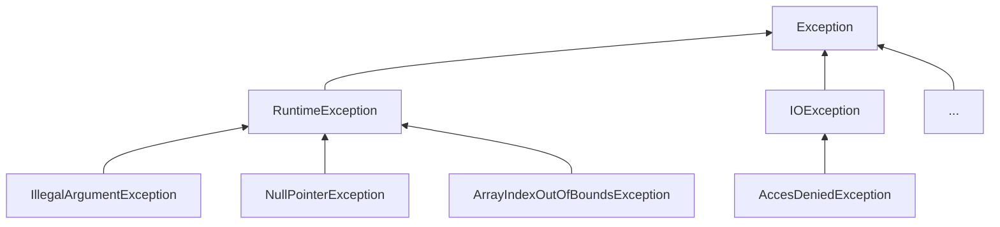

<!--
Posible prompt:
<prompt>
Tengo un cuestionario con preguntas sobre "Excepciones". Debes tener en cuenta que los conocimientos previos que tengo (y por tanto tus respuestas deben ser adaptadas), son:
- C/C++ sin orientación a objetos.
- Temas de Java previos: Clases y Objetos, Encapsulación.

Cada respuesta debe tener entre 2 - 4 párrafos de longitud (sin contar los trozos de código).

Por favor, escribe en impersonal las respuestas.

</prompt>
----
-->
# TEMA 3. Excepciones

## 1. Empecemos un tema sobre control de errores en lenguajes de programación, con algo básico. En C, donde no existen las excepciones, pongamos un ejemplo de una raíz que toma número flotante positivo. Queremos controlar el error si la función recibe un número negativo. El usuario debe ser informado pero desde fuera de la función `raiz` ¿Cómo indicamos ese error?. Enumera dos opciones diferentes de diseñar, poniendo un ejemplo de código de cada una.

#### Delvolver valor especial
```c
float raiz(float num){
    if(num < 0){
        return -1;
    }
    return sqrt(num);
}
main(){
    float num = leerDeTeclado();
    float resultado = raiz(num);

    if(resultado == -1){
        printf("Error");
    }
    else{
        printf("%d", resultado);
    }
}
```
---
#### Parametro adicional para almacenar un código de error
```c
float raiz(float num, int* error){
    if(num < 0){
        *error = 1;
        return 0;
    }
    else{
        *error = 0;
        return sqrt(num);
    }
}
main(){
    int error = 0;
    float num = leerDeTeclado();
    float resultado = raiz(num, &error);
    if(error != 0){
        printf("Error");
    }
    else{
        printf("%d", resultado);
    }
}
```


## 2. Brevemente ¿Qué es una **"excepción"**? ¿Con qué objetivo las usa un programador cuando implementa funciones o cuando las llama?

Excepción
: Surge en situaciones atípicas
Al implementar funciones nos permite indicar más claramente el error
Al llamar facilita separar la lógica normal del manejo de la situación errónea


## 3. Reescribe el mismo ejemplo de raiz, pero en Java, metiendo ese método en una clase `Calculadora` y llama a dicho método desde el método `main`, mostrando cómo se puede controlar desde fuera.

```java
class Calculadora{
    public static double raiz(double num){
        if(num < 0){
            throw new IllegalArgumentException("num negativo")
        }
        else{
            return Math.sqrt(num);
        }
    }
}
class App{
    main(){
        double num = leerDeTeclado();
        try{
            double resultado = Calculadora.raiz(num); // En caso de excepcion se rompe y no se asigna a resultado
            System.out.println(resultado); // En caso de excepcion tampoco se muestra el resultado
        }
        catch(IllegalArgumentException e){
            System.out.println("El numero es negativo")
        }
        
    }
}
```


## 4. ¿Qué es **"lanzar"** una excepción? ¿Qué es **"controlar"** o **"capturar"** una excepción? ¿Qué es que se **"propague"** una excepción? ¿Qué le va ocurriendo a las funciones en la pila de llamadas por donde se va propagando la excepción? ¿Las funciones que no la controlan se reanudan después de alguna forma? Explica con el mismo ejemplo anterior en Java de la raíz cuadrada.

### Respuesta


## 5. ¿Qué ventajas tiene frente a C, la **"propagación natural"** de las excepciones a través de la pila (*stack*) de llamadas?

### Respuesta


## 6. En orientación a objetos, ¿las excepciones suelen ser objetos? ¿Qué ventajas tiene esto en términos de encapsulación? ¿Podemos entonces crear excepciones personalizadas?

Si, suelen interpretarse como objetos

Ventajas
: 


## 7. En relación con las ventajas de la encapsulación, comparando el ejemplo en C con Java. ¿Qué **información esencial** lleva cualquier **objeto excepción** que es muy útil tener cuando se llega a un manejador?

#### Informacion Esencial
+ Un mensaje (`getMessage`)
+ La traza de la pila (`getStackTrace` o `printStackTrace`), vale para depurar
+ Opcionalmente, la "causa" (otra excepción, que es la verdadera causa)


## 8. En Java, sobre el bloque **"try-catch"**, ¿se pueden tener más de un bloque `catch`? ¿cuántos bloques `catch` se ejecutan?

Si, se puede tener mas de uno
```java
try{
    ...
}catch(TipoExcepcion e){
    ...
}catch(TipoExcepcion2 e2){
    ...
}
```
### A tener en cuenta
+ Solo se ejecuta uno
+ Se va comprobando por orden hasta el primero que encaje
+ Se deben poner del más específico al más general, de lo contrario, los catch de excepciones más especificas no se ejecutarán


## 9. Si las excepciones producen rupturas en el código llamador, ¿cómo podemos garantizar que se ejecuta siempre finalmente un código necesario para cierre de ficheros, liberacion de recursos, antes de que continúe propagándose la excepción? Pon un ejemplo en Java con `finally`, tanto con `catch` como sin él.

El finally se ejecuta siempre que se entre en el bloque `try`
```java
try{
    ...
    return 7;
}catch(...){
    ...
}catch(...){
    ...
}finally{
    ...
}
```


## 10. En Java, el bloque `finally` puede ir sin `catch`? ¿Se ejecuta siempre tanto si ocurre como si no ocurre una excepción? ¿Y si hay un `return` en medio del `try`?

Si, puede ir sin `catch`
### A tener en cuenta
+ Se ejecuta, puesto que es finally
+ Si hubo excepción, como no tenemos catch, se propaga la excepción


## 11. En Java, qué son las excepciones **"controladas"** y las **"no controladas"**? ¿Qué papel juega `RuntimeException`? Pon un ejemplo de excepciones típicas controladas y no controladas que incluso nosotros mismos podríamos usar. Haz dos listas con 3 o 4 ejemplos de situación donde se suele preferir una excepción controlada y donde se suele preferir una excepción no controlada.

Controladas
: Obliga a `try-catch` / `throws`

No controladas
: No obliga a `try-catch` / `throws`


Parte izquierda --> No controladas
Parte derecha --> Controladas

## 12. ¿Qué es y para qué se usa `throws`? ¿Por qué es alternativa a capturar una excepción controlada?

`throw`
: lanza excepción

---
`throws`
: Indica que puede lanzar una excepción

---
```java
public String leerFichero(Path p){
    try{
        ...

        ... = Files.readAllBytes(p);

    }catch(IOException e)
}
```
```java
public String leerFichero(Path p) throws IOException{
        ...

        ... = Files.readAllBytes(p);

        ...
}
```

## 13. Pon un ejemplo en Java de firma de método que incluya `throws`, de una función que abre un fichero pero que declara que no le interesa menejar la excepción de si el fichero no existe, sino que se propague hacia arriba. Eso sí, acuérdate del `finally`.

```java
public String leerFichero(Path p) throws IOException{
    try{
        ...

        ... = Files.readAllBytes(p);

        ...
    }finally{
        ...
    }
}
```


## 14. ¿Podemos poner en `throws` excepciones no controladas, como `RuntimeException`? ¿Debería el método llamador entonces poner `try-catch` en ese caso? ¿Qué sentido tendría?

+ Si se puede, pero el compilador no va a obligar al bloque `try-catch`, por lo que no es habitual
+ A veces se ponen por documentación


## 15. ¿Cuándo se recomienda usar excepciones controladas, como `IOException`, y cuándo no controladas como `IllegalArgumentException`? ¿Existen en todos los lenguajes ambas opciones? En los que sólo existe una opción, ¿cuál es la más habitual?

### Recomendable usar controladas
+ Por causas externas, como no tener conexión a internet. Es necesario un bloque `try-catch`
### Recomendable usar no controladas
+ Por bugs de programación. Es la opción más común en lenguajes de programación, y no hace falta un bloque `try-catch`


## 16. ¿Tiene sentido lanzar excepciones dentro del `catch`? ¿Se puede relanzar la misma excepción capturada? ¿Cuándo tendría sentido hacer esto último? Pon ejemplos de ambos casos.

Si, tiene sentido
#### Relanzar la mima excepcion
```java
try{
    ...
}catch(NumberFormatException e){
    ...
    throw e; // relanza la misma exceptción
}
```
#### Envolver en otra excepción nueva (será causa)
```java
try{
    ...
}catch(NumberFormatException e){
    ...
    throw new RuntimeException("Excepción de E/S", e); // envuelve en otra excepción neuva
}
```
#### Lanzar otra excepción totalmente neuva
```java
try{
    ...
}catch(IOException e){
    throw new AplicationException("Error");
}
```


## 17. ¿En qué consiste que una excepción sea la **"causa"** de otra excepción? Pon un ejemplo en Java, donde capturemos una excepción de bajo nivel y la encapsulemos en otra personalizada de alto nivel. Cuando una excepción sale por pantalla y tiene una causa, ¿se ve?

```java
try{
    ...
}catch(IOException e){
    throw new NetfluxException("Error E/S", e);
}
```
### Causa de excepción
+ Se ve cuando la excepción se muestra por pantalla
```java
Excepcion externa(NetfluxException)
    ...
Caused by excepción interna(IOException)
    ...
```
+ Se puede obtener con el método `getCause()`