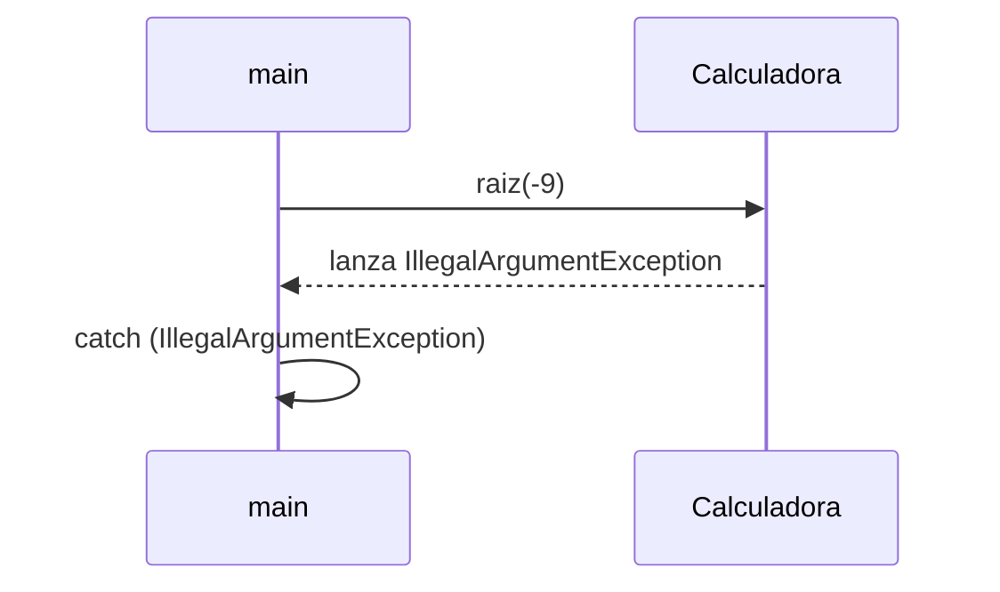

<!--
Posible prompt:
<prompt>
Tengo un cuestionario con preguntas sobre "Excepciones". Debes tener en cuenta que los conocimientos previos que tengo (y por tanto tus respuestas deben ser adaptadas), son:
- C/C++ sin orientación a objetos.
- Temas de Java previos: Clases y Objetos, Encapsulación.

Cada respuesta debe tener entre 2 - 4 párrafos de longitud (sin contar los trozos de código).

Por favor, escribe en impersonal las respuestas.

</prompt>
----
-->
# TEMA 3. Excepciones

## 1. Empecemos un tema sobre control de errores en lenguajes de programación, con algo básico. En C, donde no existen las excepciones, pongamos un ejemplo de una raíz que toma número flotante positivo. Queremos controlar el error si la función recibe un número negativo. El usuario debe ser informado pero desde fuera de la función `raiz` ¿Cómo indicamos ese error?. Enumera dos opciones diferentes de diseñar, poniendo un ejemplo de código de cada una.

En C, donde no existen excepciones, el control de errores suele realizarse mediante el uso de valores de retorno especiales o variables externas. Una opción común es devolver un valor que indique error, por ejemplo, un número negativo o cero en funciones que normalmente devuelven solo valores positivos. El código que llama a la función debe comprobar este valor y actuar en consecuencia.

```c
// Opción 1: Valor de retorno especial
float raiz(float x) {
	if (x < 0) return -1.0; // Indica error
	return sqrt(x);
}

// Uso:
float resultado = raiz(-9);
if (resultado < 0) {
	printf("Error: número negativo\n");
}
```

Otra opción es utilizar un parámetro adicional, como un puntero a una variable de error, o bien una variable global, para indicar si ha ocurrido un error. Así, la función puede devolver el resultado normalmente y el error se comunica por otro canal.

```c
// Opción 2: Parámetro de error
int raiz(float x, float* resultado) {
	if (x < 0) return 0; // 0 indica error
	*resultado = sqrt(x);
	return 1; // 1 indica éxito
}

// Uso:
float res;
if (!raiz(-9, &res)) {
	printf("Error: número negativo\n");
}
```


## 2. Brevemente ¿Qué es una **"excepción"**? ¿Con qué objetivo las usa un programador cuando implementa funciones o cuando las llama?

### Respuesta

Una excepción es un mecanismo que permite señalar la ocurrencia de un error o situación inesperada durante la ejecución de un programa. A diferencia de los códigos de error tradicionales, las excepciones interrumpen el flujo normal del programa y transfieren el control a un bloque especial encargado de gestionar ese error.

El objetivo principal de las excepciones es separar el código que detecta un error del código que lo maneja, facilitando así la legibilidad y el mantenimiento. Cuando se implementan funciones, se pueden lanzar excepciones para indicar condiciones anómalas, y cuando se llaman funciones, se pueden capturar para decidir cómo responder ante esos problemas. Esto permite un manejo de errores más estructurado y menos propenso a omisiones que el uso de valores de retorno.


## 3. Reescribe el mismo ejemplo de raiz, pero en Java, metiendo ese método en una clase `Calculadora` y llama a dicho método desde el método `main`, mostrando cómo se puede controlar desde fuera.

### Respuesta

En Java, el manejo de errores mediante excepciones permite encapsular la lógica en clases y métodos. A continuación, se muestra cómo se puede implementar el cálculo de la raíz cuadrada en una clase `Calculadora`, lanzando una excepción si el número es negativo, y controlando el error desde el método `main`.

```java
class Calculadora {
	public static double raiz(double x) throws IllegalArgumentException {
		if (x < 0) {
			throw new IllegalArgumentException("No se puede calcular la raíz de un número negativo");
		}
		return Math.sqrt(x);
	}
}

public class Main {
	public static void main(String[] args) {
		try {
			double resultado = Calculadora.raiz(-9);
			System.out.println("Resultado: " + resultado);
		} catch (IllegalArgumentException e) {
			System.out.println("Error: " + e.getMessage());
		}
	}
}
```

En este ejemplo, el método `raiz` lanza una excepción si el argumento es negativo, y el método `main` la captura y muestra el mensaje de error al usuario.


## 4. ¿Qué es **"lanzar"** una excepción? ¿Qué es **"controlar"** o **"capturar"** una excepción? ¿Qué es que se **"propague"** una excepción? ¿Qué le va ocurriendo a las funciones en la pila de llamadas por donde se va propagando la excepción? ¿Las funciones que no la controlan se reanudan después de alguna forma? Explica con el mismo ejemplo anterior en Java de la raíz cuadrada.

### Respuesta

"Lanzar"
: Significa interrumpir el flujo normal de ejecución de un método cuando ocurre una condición anómala, creando un objeto excepción y transfiriendo el control a la estructura de manejo de errores más cercana. 

"Controlar" o "capturar" 
: Implica interceptar esa excepción mediante un bloque `catch` para gestionar el error de forma adecuada. "Propagar" una excepción es dejar que la excepción siga subiendo por la pila de llamadas hasta que algún método la capture.

Cuando una excepción se propaga, cada función en la pila de llamadas se va "desapilando" hasta encontrar un manejador adecuado. Las funciones que no capturan la excepción no se reanudan después; su ejecución se interrumpe y se liberan sus recursos locales. Por ejemplo, en el caso de la raíz cuadrada en Java, si `Calculadora.raiz(-9)` lanza una excepción y no se captura en el método que la llamó, la excepción seguirá subiendo hasta que algún bloque `catch` la capture o el programa termine.




## 5. ¿Qué ventajas tiene frente a C, la **"propagación natural"** de las excepciones a través de la pila (*stack*) de llamadas?

### Respuesta

La propagación natural de las excepciones en Java permite que los errores se manejen en el nivel más adecuado del programa, sin necesidad de comprobar manualmente los valores de retorno tras cada llamada, como ocurre en C. Esto reduce la cantidad de código repetitivo y mejora la claridad, ya que el flujo de control se centra en la lógica principal y el manejo de errores se delega a bloques específicos.

Además, la propagación automática garantiza que los recursos locales de cada función se liberen correctamente al abandonar la pila, y que los errores no pasen desapercibidos. En C, si se olvida comprobar un valor de retorno, el error puede propagarse silenciosamente, mientras que en Java una excepción no capturada termina el programa, haciendo más evidente el problema.


## 6. En orientación a objetos, ¿las excepciones suelen ser objetos? ¿Qué ventajas tiene esto en términos de encapsulación? ¿Podemos entonces crear excepciones personalizadas?

### Respuesta

En orientación a objetos, las excepciones suelen ser objetos que heredan de la clase base `Exception` en Java. Esto permite encapsular información relevante sobre el error, como el mensaje, la causa y otros datos personalizados, aprovechando los principios de la programación orientada a objetos.

El hecho de que las excepciones sean objetos facilita la creación de tipos personalizados de errores, adaptados a las necesidades de cada aplicación. Además, permite aprovechar la herencia y el polimorfismo para manejar diferentes tipos de excepciones de manera flexible y estructurada.


## 7. En relación con las ventajas de la encapsulación, comparando el ejemplo en C con Java. ¿Qué **información esencial** lleva cualquier **objeto excepción** que es muy útil tener cuando se llega a un manejador?

### Respuesta

Comparando C y Java, en Java cualquier objeto excepción lleva información esencial como el tipo de error (la clase de la excepción), un mensaje descriptivo y, opcionalmente, la causa original del error (otra excepción). Esta información es muy útil cuando se llega a un manejador, ya que permite identificar el problema con precisión y tomar decisiones informadas.

En C, normalmente solo se dispone de un código de error o un valor especial, lo que limita la cantidad de información disponible. En Java, además del mensaje, se puede acceder a la traza de la pila de llamadas, lo que facilita el diagnóstico y la depuración de errores complejos.


## 8. En Java, sobre el bloque **"try-catch"**, ¿se pueden tener más de un bloque `catch`? ¿cuántos bloques `catch` se ejecutan?

### Respuesta

En Java, es posible tener más de un bloque `catch` tras un bloque `try`. Cada bloque `catch` puede capturar un tipo diferente de excepción. Sin embargo, cuando ocurre una excepción, solo se ejecuta el primer bloque `catch` cuyo tipo coincide con la excepción lanzada; los demás se omiten.

Esto permite manejar distintos tipos de errores de forma diferenciada, pero garantiza que una excepción solo sea gestionada por un único bloque `catch` en cada estructura `try-catch`.


## 9. Si las excepciones producen rupturas en el código llamador, ¿cómo podemos garantizar que se ejecuta siempre finalmente un código necesario para cierre de ficheros, liberacion de recursos, antes de que continúe propagándose la excepción? Pon un ejemplo en Java con `finally`, tanto con `catch` como sin él.

### Respuesta

Para garantizar la liberación de recursos o la ejecución de código necesario, Java proporciona el bloque `finally`. El código dentro de `finally` se ejecuta siempre, ocurra o no una excepción, e incluso si hay un `return` en el bloque `try` o `catch`. Esto es útil para cerrar ficheros, liberar memoria o realizar otras tareas de limpieza.

Ejemplo con `catch`:
```java
try {
	// Código que puede lanzar excepción
	FileInputStream f = new FileInputStream("archivo.txt");
	// ...
} catch (FileNotFoundException e) {
	System.out.println("Archivo no encontrado");
} finally {
	System.out.println("Cierre de recursos");
}
```

Ejemplo sin `catch`:
```java
try {
	// Código que puede lanzar excepción
	FileInputStream f = new FileInputStream("archivo.txt");
	// ...
} finally {
	System.out.println("Cierre de recursos");
}
```


## 10. En Java, el bloque `finally` puede ir sin `catch`? ¿Se ejecuta siempre tanto si ocurre como si no ocurre una excepción? ¿Y si hay un `return` en medio del `try`?

### Respuesta

Sí, el bloque `finally` puede ir sin `catch`. El bloque `finally` se ejecuta siempre, tanto si ocurre una excepción como si no, e incluso si hay un `return` en el bloque `try`. La única excepción es si el programa termina abruptamente (por ejemplo, con `System.exit`).

Esto garantiza que el código de limpieza se ejecute pase lo que pase, lo que es fundamental para evitar fugas de recursos.


## 11. En Java, qué son las excepciones **"controladas"** y las **"no controladas"**? ¿Qué papel juega `RuntimeException`? Pon un ejemplo de excepciones típicas controladas y no controladas que incluso nosotros mismos podríamos usar. Haz dos listas con 3 o 4 ejemplos de situación donde se suele preferir una excepción controlada y donde se suele preferir una excepción no controlada.

### Respuesta

Excepciones "controladas" (checked)
: Son aquellas que el compilador obliga a declarar o capturar, y suelen derivar de `Exception` pero no de `RuntimeException`. 

Excepciones "no controladas" (unchecked)
: Son subclases de `RuntimeException` y no requieren declaración ni captura obligatoria.

`RuntimeException` es la clase base de las excepciones no controladas, que suelen indicar errores de programación, como referencias nulas o índices fuera de rango.

Ejemplos de excepciones controladas:
- `IOException` (error de entrada/salida)
- `SQLException` (error de base de datos)
- `FileNotFoundException` (archivo no encontrado)

Ejemplos de excepciones no controladas:
- `NullPointerException` (referencia nula)
- `ArrayIndexOutOfBoundsException` (índice fuera de rango)
- `IllegalArgumentException` (argumento inválido)

Situaciones donde se prefiere excepción controlada:
- Fallo al abrir un archivo
- Error de red
- Problemas de acceso a base de datos

Situaciones donde se prefiere excepción no controlada:
- Error de lógica de programación
- Violación de precondiciones
- Acceso a elementos inexistentes en colecciones


## 12. ¿Qué es y para qué se usa `throws`? ¿Por qué es alternativa a capturar una excepción controlada?

### Respuesta

`throws` se utiliza en la firma de un método para indicar que puede lanzar una excepción que no maneja internamente. Es una alternativa a capturar una excepción controlada, permitiendo que la responsabilidad de gestionarla recaiga en el método llamador.

Esto es útil cuando un método no puede o no debe decidir cómo manejar ciertos errores, delegando esa decisión a un nivel superior de la aplicación.


## 13. Pon un ejemplo en Java de firma de método que incluya `throws`, de una función que abre un fichero pero que declara que no le interesa menejar la excepción de si el fichero no existe, sino que se propague hacia arriba. Eso sí, acuérdate del `finally`.

### Respuesta

Ejemplo de método que declara `throws` y utiliza `finally`:

```java
public void abrirArchivo(String nombre) throws FileNotFoundException {
	FileInputStream f = null;
	try {
		f = new FileInputStream(nombre);
		// ...
	} finally {
		if (f != null) {
			try { f.close(); } catch (IOException e) { /* Ignorar */ }
		}
	}
}
```

En este caso, si el archivo no existe, se lanza `FileNotFoundException` y no se captura en el método, sino que se propaga hacia arriba.


## 14. ¿Podemos poner en `throws` excepciones no controladas, como `RuntimeException`? ¿Debería el método llamador entonces poner `try-catch` en ese caso? ¿Qué sentido tendría?

### Respuesta

Sí, se pueden poner excepciones no controladas como `RuntimeException` en `throws`, pero no es obligatorio. El método llamador no está obligado a capturarlas, aunque puede hacerlo si lo desea. Declararlas en `throws` puede servir como documentación, pero no cambia el comportamiento del compilador.

El sentido de capturarlas depende de si se quiere manejar errores de lógica o dejar que el programa falle para detectar fallos de programación.


## 15. ¿Cuándo se recomienda usar excepciones controladas, como `IOException`, y cuándo no controladas como `IllegalArgumentException`? ¿Existen en todos los lenguajes ambas opciones? En los que sólo existe una opción, ¿cuál es la más habitual?

### Respuesta

Se recomienda usar excepciones controladas para situaciones que pueden preverse y recuperarse, como errores de entrada/salida o de red. Las no controladas se usan para errores de programación, como argumentos inválidos o estados inconsistentes.

No todos los lenguajes distinguen entre ambos tipos; en muchos solo existen excepciones no controladas, siendo la opción más habitual.


## 16. ¿Tiene sentido lanzar excepciones dentro del `catch`? ¿Se puede relanzar la misma excepción capturada? ¿Cuándo tendría sentido hacer esto último? Pon ejemplos de ambos casos.

### Respuesta

Tiene sentido lanzar excepciones dentro de un `catch` cuando se detecta que el error no puede ser resuelto localmente y debe ser gestionado por un nivel superior. También se puede relanzar la misma excepción capturada usando `throw;` en otros lenguajes o `throw e;` en Java.

#### Ejemplo de lanzar una nueva excepción:
```java
try {
	// ...
} catch (IOException e) {
	throw new RuntimeException("Error de IO", e);
}
```

#### Ejemplo de relanzar la misma excepción:
```java
try {
	// ...
} catch (IOException e) {
	// Realizar alguna acción
	throw e;
}
```


## 17. ¿En qué consiste que una excepción sea la **"causa"** de otra excepción? Pon un ejemplo en Java, donde capturemos una excepción de bajo nivel y la encapsulemos en otra personalizada de alto nivel. Cuando una excepción sale por pantalla y tiene una causa, ¿se ve?

### Respuesta

Una excepción puede ser la "causa" de otra cuando se captura una excepción de bajo nivel y se encapsula en una excepción personalizada de alto nivel, manteniendo la información original. Esto permite abstraer detalles internos y proporcionar mensajes más claros.

Ejemplo en Java:
```java
try {
	// Código que puede lanzar IOException
} catch (IOException e) {
	throw new MiExcepcionDeAltoNivel("Fallo al procesar archivo", e);
}
```

Cuando una excepción tiene una causa, al imprimir la traza se muestra la cadena de excepciones, facilitando el diagnóstico del error original.

