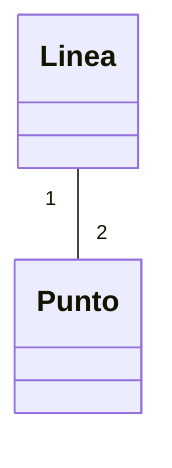
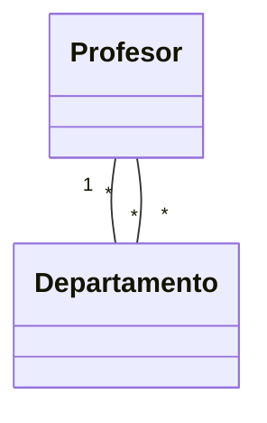

<!--
Posible prompt:
<prompt>
Tengo un cuestionario con preguntas sobre "Composición". Debes tener en cuenta que los conocimientos previos que tengo (y por tanto tus respuestas deben ser adaptadas), son:
- C/C++ sin orientación a objetos.
- Temas de Java previos: Clases y Objetos, Encapsulación y Excepciones.

Cada respuesta debe tener entre 2 - 4 párrafos de longitud (sin contar los trozos de código).

Por favor, escribe en impersonal las respuestas.

</prompt>
----
-->
# Tema 4.1. Composición


## 1. En C, podemos crear estructuras mayores **componiendo** unas con otras, que suelen describirse como "A tiene-un/tiene-varios B". Pon un ejemplo, empleando `struct`, de una línea de puntos, donde puntos tienen dos coordenadas (`x` e `y`), y la línea esta hecha de dos puntos. Incluye una función para calcular la distancia entre puntos y otra para hallar la longitud de una línea.

### Respuesta

**En C, la composición de estructuras permite crear tipos complejos a partir de otros más simples.** Por ejemplo, una línea puede estar compuesta por dos puntos, y cada punto tiene dos coordenadas. Esto se expresa mediante la inclusión de una estructura dentro de otra.

```c
typedef struct {
	float x;
	float y;
} Punto;

typedef struct {
	Punto inicio;
	Punto fin;
} Linea;

float distancia(Punto a, Punto b) {
	float dx = a.x - b.x;
	float dy = a.y - b.y;
	return sqrt(dx*dx + dy*dy);
}

float longitud(Linea l) {
	return distancia(l.inicio, l.fin);
}
```

**Resumen:**
- Se define `Punto` con dos coordenadas.
- `Linea` contiene dos `Punto`.
- Se implementan funciones para calcular la distancia entre puntos y la longitud de la línea.


## 2. Ahora transforma ese ejemplo a orientación a objetos con Java, para tener un primer ejemplo de **composición** en orientación a objetos. Crea una clase `Punto`, y una clase `Linea`. La clase `Punto` debe tener un método para calcular distancia a otro `Punto` y `Linea` debe tener un método para calcular su longitud. Gracias a la ocultación de información, supera a C, garantizando que los puntos sean inmutables, al igual que la línea, que una vez creada, no queremos que se modifique de qué a qué puntos va dicha línea.  

### Respuesta

**En Java, la composición se implementa mediante la inclusión de objetos como atributos de una clase.** Además, la encapsulación permite garantizar la inmutabilidad de los objetos, algo que en C no es posible de forma directa.

```java
public final class Punto {
	private final double x;
	private final double y;

	public Punto(double x, double y) {
		this.x = x;
		this.y = y;
	}

	public double getX() { return x; }
	public double getY() { return y; }

	public double distancia(Punto otro) {
		double dx = this.x - otro.x;
		double dy = this.y - otro.y;
		return Math.sqrt(dx*dx + dy*dy);
	}
}

public final class Linea {
	private final Punto inicio;
	private final Punto fin;

	public Linea(Punto inicio, Punto fin) {
		this.inicio = inicio;
		this.fin = fin;
	}

	public Punto getInicio() { return inicio; }
	public Punto getFin() { return fin; }

	public double longitud() {
		return inicio.distancia(fin);
	}
}
```

**Ventajas respecto a C:**
- Los objetos son inmutables (no se pueden modificar tras su creación).
- La composición se expresa de forma clara y segura.


## 3. ¿Qué significa la **multiplicidad** en la composición? En el ejemplo anterior, ¿cuál es la multiplicidad entre `Linea` y `Punto`? Indícalo expresando la multiplicidad en ambas direcciones, de `Linea` a `Punto` y de `Punto` a `Linea`.

### Respuesta

**La multiplicidad** indica cuántas instancias de una clase pueden estar asociadas a otra en una relación de composición.

- De `Linea` a `Punto`: Una `Linea` está compuesta exactamente por **dos** puntos. Multiplicidad: `2`.
- De `Punto` a `Linea`: Un mismo `Punto` puede pertenecer a ninguna, una o varias líneas. Multiplicidad: `0..*` (cero o más).

**Resumen en notación UML:**



Esto significa que cada línea tiene exactamente dos puntos, pero un punto puede estar en varias líneas.


## 4. ¿Qué significa composición **fuerte** y composición **débil**? ¿Qué consecuencia implica en relación al ciclo de vida de los objetos? Indica a cuál solemos referirnos como **"asociación o agregación"** y a cuál como **"composición"** propiamente.

### Respuesta

**Composición fuerte** (composición propiamente dicha):
- El objeto "contenedor" es responsable del ciclo de vida de los objetos contenidos.
- Si el contenedor se destruye, los objetos contenidos también.
- Ejemplo: Una línea que crea y destruye sus puntos.

**Composición débil** (agregación o asociación):
- El objeto contenido puede existir independientemente del contenedor.
- El ciclo de vida de los objetos no está ligado.
- Ejemplo: Un departamento y sus profesores, donde los profesores pueden existir fuera del departamento.

**Resumen:**
- "Composición" suele referirse a la composición fuerte.
- "Agregación" o "asociación" suele referirse a la composición débil.


## 5. Cuando una clase usa a otra al recibirla o devolverla como parámetro en algún método, al hacer `new` dentro de un método, o al usarlas como variables locales, ¿hablamos de composición o de **"dependencia"**?

### Respuesta

En estos casos se habla de **dependencia** y no de composición. La dependencia ocurre cuando una clase utiliza otra de forma puntual, por ejemplo:

- Como parámetro o valor de retorno en un método.
- Como variable local dentro de un método.
- Al crear un objeto temporalmente con `new` dentro de un método.

**Resumen:**
- La composición implica que la clase dependiente mantiene una referencia como atributo.
- La dependencia es una relación más débil y temporal.


## 6. En el ejemplo anterior de línea y punto, programa la relación entre `Linea` y `Punto` de dos formas. Una **como composición fuerte**, donde el ciclo de vida de los puntos está ligado al de Linea y otra **como composición débil**, donde no.

### Respuesta

**Composición fuerte:**
```java
public final class Linea {
	private final Punto inicio;
	private final Punto fin;

	public Linea(double x1, double y1, double x2, double y2) {
		this.inicio = new Punto(x1, y1);
		this.fin = new Punto(x2, y2);
	}
	// ...
}
```
En este caso, los puntos sólo existen dentro de la línea y no pueden compartirse.

**Composición débil:**
```java
public final class Linea {
	private final Punto inicio;
	private final Punto fin;

	public Linea(Punto inicio, Punto fin) {
		this.inicio = inicio;
		this.fin = fin;
	}
	// ...
}
```
Aquí, los puntos pueden existir fuera de la línea y ser compartidos por varias líneas.


## 7. En Java, en la composición fuerte, ¿cuando el contenedor destruye los objetos? No se observa que `Linea` destruya los `Punto` explícitamente, ¿Por qué?

### Respuesta

En Java, el contenedor no destruye explícitamente los objetos que contiene porque la **gestión de memoria es automática** mediante el recolector de basura (garbage collector).

- Cuando un objeto (por ejemplo, una `Linea`) deja de tener referencias a sus objetos internos (`Punto`), estos quedan disponibles para ser eliminados automáticamente.
- No es necesario ni posible destruir objetos manualmente como en C++.

**Resumen:**
- El ciclo de vida de los objetos está ligado por las referencias, pero la destrucción es automática.


## 8. Pon un ejemplo de composicion débil entre un departamento que tiene varios profesores. Implementa dos composiciones a la vez: entre el departamento y todos sus profesores y entre el departamento y su director, que es un profesor del departamento. Siempre debe haber un director en el departamento desde el inicio. Lanza excepciones si se viola la invariante. Emplea arrays primitivos de Java, estilo `Profesor[]`, con máximo 50, pero no rompas la encapsulación, no desveles que estás empleando un array, permite añadir un `Profesor` al final de la lista, y eliminar un profesor dada su posición. Da acceso a los profesores con un método para saber cuántos hay y otro para obtener un profesor por posición. El director se puede cambiar por otro profesor del departamento. Sin embargo, ten en cuenta esta invariante de clase: el director debe formar siempre parte de la lista de profesores, es decir, ten cuidado al cambiar el director o al eliminar un profesor.

### Respuesta

**Ejemplo de composición débil entre Departamento y Profesor:**

```java
public class Profesor {
	private final String nombre;
	public Profesor(String nombre) { this.nombre = nombre; }
	public String getNombre() { return nombre; }
}

public class Departamento {
	private final Profesor[] profesores = new Profesor[50];
	private int numProfesores = 0;
	private Profesor director;

	public Departamento(Profesor director) {
		anadirProfesor(director);
		this.director = director;
	}

	public void anadirProfesor(Profesor p) {
		if (numProfesores >= 50) throw new IllegalStateException("Máximo alcanzado");
		profesores[numProfesores++] = p;
	}

	public void eliminarProfesor(int pos) {
		if (pos < 0 || pos >= numProfesores) throw new IndexOutOfBoundsException();
		if (profesores[pos] == director) throw new IllegalStateException("No se puede eliminar al director");
		for (int i = pos; i < numProfesores - 1; i++) {
			profesores[i] = profesores[i + 1];
		}
		profesores[--numProfesores] = null;
	}

	public int getNumProfesores() { return numProfesores; }

	public Profesor getProfesor(int pos) {
		if (pos < 0 || pos >= numProfesores) throw new IndexOutOfBoundsException();
		return profesores[pos];
	}

	public Profesor getDirector() { return director; }

	public void cambiarDirector(Profesor nuevo) {
		boolean encontrado = false;
		for (int i = 0; i < numProfesores; i++) {
			if (profesores[i] == nuevo) {
				encontrado = true;
				break;
			}
		}
		if (!encontrado) throw new IllegalArgumentException("El director debe ser profesor del departamento");
		director = nuevo;
	}
}
```

**Características:**
- El director siempre es un profesor del departamento.
- No se puede eliminar al director.
- Se controla el acceso y la modificación de la lista de profesores.


## 9. En Java, existen también `List`, cambia y muestra cómo sería el código anterior empleando `List` en vez de arrays primitivos. ¿Qué parte del código original te has ahorrado? Además, fíjate en el método `getProfesor(int pos)`: si en su lugar existiera un método que devolviera todos los profesores a la vez, ¿qué problema tendría devolver directamente la lista interna? ¿Cómo lo resolverías?

### Respuesta

**Usando `List` en vez de arrays:**

```java
import java.util.*;

public class Departamento {
	private final List<Profesor> profesores = new ArrayList<>();
	private Profesor director;

	public Departamento(Profesor director) {
		anadirProfesor(director);
		this.director = director;
	}

	public void anadirProfesor(Profesor p) {
		profesores.add(p);
	}

	public void eliminarProfesor(int pos) {
		if (profesores.get(pos) == director) throw new IllegalStateException("No se puede eliminar al director");
		profesores.remove(pos);
	}

	public int getNumProfesores() { return profesores.size(); }

	public Profesor getProfesor(int pos) { return profesores.get(pos); }

	public Profesor getDirector() { return director; }

	public void cambiarDirector(Profesor nuevo) {
		if (!profesores.contains(nuevo)) throw new IllegalArgumentException("El director debe ser profesor del departamento");
		director = nuevo;
	}

	// Para evitar exponer la lista interna:
	public List<Profesor> getProfesores() {
		return Collections.unmodifiableList(new ArrayList<>(profesores));
	}
}
```

**Ventajas respecto al array:**
- No es necesario gestionar el tamaño ni los desplazamientos manualmente.
- El método `getProfesores()` devuelve una copia inmodificable, evitando que se rompa la encapsulación.


## 10. Al igual que ocurre con las excepciones en Java, que pueden encerrar causas (que son excepciones), de forma recursiva, suponen un tipo especial de composiciones, denominadas composiciones recursivas. Pon un ejemplo en Java de una `Persona`, que sea inmutable, y que tiene una madre, que es otra `Persona`. Haz un main con un ejemplo de uso con una familia de personas, desde el nieto hasta la abuela. Enumera algún otro ejemplo clásico de composiciones recursivas.

### Respuesta

**Ejemplo de composición recursiva:**

```java
public final class Persona {
	private final String nombre;
	private final Persona madre;

	public Persona(String nombre, Persona madre) {
		this.nombre = nombre;
		this.madre = madre;
	}

	public String getNombre() { return nombre; }
	public Persona getMadre() { return madre; }
}

public class Main {
	public static void main(String[] args) {
		Persona abuela = new Persona("Ana", null);
		Persona madre = new Persona("Beatriz", abuela);
		Persona hijo = new Persona("Carlos", madre);
		System.out.println(hijo.getNombre() + ", madre: " + hijo.getMadre().getNombre());
		System.out.println("Abuela: " + hijo.getMadre().getMadre().getNombre());
	}
}
```

**Otros ejemplos clásicos:**
- Árboles binarios (cada nodo tiene hijos que son nodos).
- Carpetas y archivos en un sistema de archivos.

## 11. ¿Qué son las relaciones de composición "bidireccionales"? ¿Qué habría que hacer para implementar este tipo de relación en el ejemplo de `Profesor` y `Departamento`?

### Respuesta

**Relaciones de composición bidireccionales** son aquellas en las que ambos objetos mantienen una referencia mutua entre sí.

En el ejemplo de `Profesor` y `Departamento`, para implementar una relación bidireccional sería necesario que:

- Cada `Profesor` tuviera una referencia a su `Departamento`.
- El `Departamento` mantuviera la lista de sus profesores.

**Precaución:**
- Es importante mantener la coherencia al modificar cualquiera de las dos partes, para evitar referencias inconsistentes.

**Ejemplo de diagrama:**



Esto implica que al añadir o eliminar un profesor del departamento, también debe actualizarse la referencia en el objeto `Profesor`.
