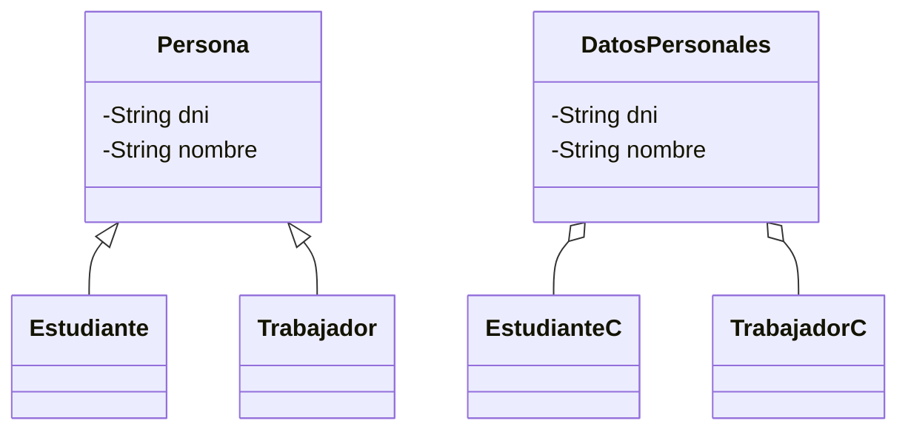

<!--
Posible prompt:
<prompt>
Tengo un cuestionario con preguntas sobre "Herencia". Debes tener en cuenta que los conocimientos previos que tengo (y por tanto tus respuestas deben ser adaptadas), son:
- C/C++ sin orientación a objetos.
- Temas de Java previos: Clases y Objetos, Encapsulación, Excepciones y Composición.

Cada respuesta debe tener entre 2 - 4 párrafos de longitud (sin contar los trozos de código).

Por favor, escribe en impersonal las respuestas.

</prompt>
----
-->
## 1. En orientación a objetos, ¿qué es la **herencia** y su relación con "A es-un B"?. Explica las dos implicaciones principales: (1) **compatibilidad de tipos** y (2) **herencia de estado y comportamiento**. Pon un ejemplo en Java muy sencillo, donde un `Soldado` tiene un `nombre` (privado) y un método `saludar()` que muestra su nombre. Hay dos subtipos: un `Artillero`, que es capaz de disparar cohetes y un `Zapador` que pone minas, ambos heredan el atributo nombre y la capacidad de saludar. Además, y de forma específica, el artillero tiene un número de cohetes y el zapador un número de minas, accesibles mediante "getters" específicos. Respecto a la compatibilidad de tipos, aprovechémosla: crea un array de `Soldado`, mete varios de distinto tipo (son todos compatibles con `Soldado`). Recórrela y que todos te saluden.


**Herencia** en orientación a objetos es un mecanismo que permite definir una clase (subclase) a partir de otra (superclase), heredando sus atributos y métodos. La relación "A es-un B" significa que una instancia de la subclase puede ser tratada como una instancia de la superclase, lo que se conoce como **compatibilidad de tipos**.

#### Implicaciones principales

- **Compatibilidad de tipos:**
	- Permite que objetos de subclases sean usados donde se espera un objeto de la superclase.
	- Ejemplo: Si `Artillero` y `Zapador` heredan de `Soldado`, ambos pueden almacenarse en un array de tipo `Soldado`.
- **Herencia de estado y comportamiento:**
	- Los atributos (estado) y métodos (comportamiento) definidos en la superclase son heredados por las subclases.
	- Las subclases pueden añadir o especializar funcionalidades.

#### Ejemplo en Java

>*Soldado*
```java
class Soldado {
	private String nombre;
	public Soldado(String nombre) {
		this.nombre = nombre;
	}
	public void saludar() {
		System.out.println("Le saluda el soldado " + nombre);
	}
}
```
>*Soldado*
Tipo: *Artillero*
```java
class Artillero extends Soldado {
	private int cohetes;
	public Artillero(String nombre, int cohetes) {
		super(nombre);
		this.cohetes = cohetes;
	}
	public int getCohetes() { return cohetes; }
}
```
>*Soldado*
Tipo: *Zapador*
```java
class Zapador extends Soldado {
	private int minas;
	public Zapador(String nombre, int minas) {
		super(nombre);
		this.minas = minas;
	}
	public int getMinas() { return minas; }
}
```
---
```java
class pruebaHerencia {
	public static void main (String[] args){
		// Uso de compatibilidad de tipos
		Soldado[] escuadron = {
			new Artillero("Juan", 5),
			new Zapador("Luis", 3),
			new Artillero("Ana", 2)
		};
		for (Soldado s : escuadron) {
			s.saludar();
		}
	}
}
```

En este ejemplo, todos los objetos pueden saludar, aunque sean de tipos concretos distintos, gracias a la compatibilidad de tipos.


## 2. Al crear los soldados concretos, ¿cuántos constructores se ejecutan y en qué orden? ¿Qué significa `super` dentro de un constructor? Si la clase base no tiene visible el constructor sin parámetros, ¿debo llamar a `super` siempre? 


Al crear un objeto de una subclase, se ejecutan **dos constructores**: primero el de la superclase y luego el de la subclase. El orden es siempre de arriba hacia abajo en la jerarquía de herencia.

- El uso de `super` en el constructor de la subclase sirve para invocar explícitamente el constructor de la superclase y pasarle los parámetros necesarios para inicializar los atributos heredados.

> **Nota:** Si la superclase no tiene un constructor sin parámetros visible, es obligatorio llamar a `super` con los argumentos adecuados desde el constructor de la subclase.

**Ejemplo:**

```java
class Soldado {
	public Soldado(String nombre) { /* ... */ }
}
class Artillero extends Soldado {
	public Artillero(String nombre, int cohetes) {
		super(nombre); // Obligatorio si Soldado no tiene constructor sin parámetros
		// ...
	}
}
```

En resumen:

- Siempre se ejecuta primero el constructor de la superclase.
- Si la superclase no tiene constructor sin parámetros, hay que llamar a `super` explícitamente.

## 3. Respecto a los objetos de subclases en memoria, los atributos privados de la superclase, ¿forman parte de una instancia de la subclase en memoria? En caso afirmativo ¿implica que se puedan usar desde el código de la subclase? Explícalo con el ejemplo de `Soldado` y alguna de sus subclases.


Los atributos privados de la superclase **sí forman parte** de la instancia de la subclase en memoria. Sin embargo, **no pueden ser accedidos directamente** desde el código de la subclase debido a las reglas de encapsulación.

**Ejemplo:**

```java
class Soldado {
	private String nombre;
	// ...
}
class Artillero extends Soldado {
	public void mostrarNombre() {
		// System.out.println(nombre); // Error: 'nombre' es privado en Soldado
	}
}
```

Aunque el atributo `nombre` existe en cada objeto `Artillero`, no es accesible directamente. Para acceder a él, se debe proporcionar un método público o protegido en la superclase, como un getter.

**Resumen:**

- Los atributos privados existen en la memoria de la subclase.
- No son accesibles directamente desde la subclase.

## 4. ¿Qué implica en términos de **extensibilidad** de código el hecho de que sean compatibles a nivel de tipos? Ilustra esto añadiendo un nuevo tipo de `Soldado` y demostrando que el código para pedir el saludo a todos los soldados no se modifica.


La compatibilidad de tipos permite **extender el sistema** añadiendo nuevas subclases sin modificar el código que opera sobre la superclase. Esto facilita la extensibilidad y el mantenimiento del software.

**Ejemplo:**
> *Soldado*
Tipo: *Piloto*
```java
class Piloto extends Soldado {
	public Piloto(String nombre) { super(nombre); }
}
```
---
```java
// El código que recorre el array de Soldado no cambia:
Soldado[] escuadron = {
	new Artillero("Juan", 5),
	new Zapador("Luis", 3),
	new Piloto("Pedro")
};
for (Soldado s : escuadron) {
	s.saludar();
}
```

**Conclusión:**

- Se pueden añadir nuevos tipos de soldados sin modificar el código que los utiliza, gracias a la compatibilidad de tipos.


## 5. En Java, cuando trabajo con referencias y herencia. ¿Puedo tener una referencia del supertipo que apunte a objetos reales de un subtipo? ¿Puedo invocar con la referencia del supertipo a métodos públicos del subtipo? ¿En qué consiste el **"upcasting"** y el **"downcasting"**? ¿Qué es el `instanceof`? Pon un ejemplo de recorrido de un array de `Soldado`, comprobando que, si el objeto real es un `Artillero`, solicite el número de cohetes que tiene y los imprima.


En Java, **sí se puede** tener una referencia del supertipo (`Soldado`) que apunte a un objeto real de un subtipo (`Artillero` o `Zapador`). Esto se llama **upcasting** y ocurre de forma implícita.

- Solo se pueden invocar métodos definidos en el tipo de la referencia, no en el subtipo, a menos que se haga un **downcasting** (conversión explícita).
- El operador `instanceof` permite comprobar el tipo real del objeto referenciado.

#### Definiciones

- **Upcasting:** Asignar un objeto de una subclase a una referencia de la superclase (implícito).
- **Downcasting:** Convertir una referencia de la superclase a una referencia de la subclase (explícito, requiere comprobación con `instanceof`).

#### Ejemplo

```java
Soldado s = new Artillero("Juan", 10); // Upcasting (automático)
for (Soldado s : escuadron) {
	s.saludar();
	if (s instanceof Artillero) {
		Artillero a = (Artillero) s; // Downcasting
		System.out.println("Cohetes: " + a.getCohetes());
	}
	// Otra forma (moderno)
	if(s instanceof Artillero a) {
		System.out.println("Cohetes: " + a.getCochetes())
	}
}
```
>**Nota:** Solo muestra la munición en el caso de los artilleros, si no lo es, solo saluda

En este ejemplo, se recorre un array de `Soldado` y, usando `instanceof`, se identifica si el objeto es un `Artillero` para acceder a su método específico.


## 6. Respecto a la ocultación de información y herencia, ¿qué significa acceso **"protegido"** de métodos y/o atributos? ¿Cómo se implementa en Java? Pon un ejemplo de uso de en la clase `Soldado` para que su nombre sea protegido y pueda usarse en el método de poner bombas del `Zapador`.


El acceso **protegido** (`protected`) permite que un atributo o método sea accesible desde la propia clase, sus subclases y otras clases del mismo paquete, pero no desde fuera de ellos.

**Implementación en Java:**

```java
class Soldado {
	protected String nombre;
	// ...
}
```
```java
class Zapador extends Soldado {
	// ...
	public void ponerMina() {
		System.out.println("Zapador " + nombre + " ha puesto una mina"); // Acceso permitido
	}
}
```

En este ejemplo, el atributo `nombre` es protegido y puede ser usado directamente en la subclase `Zapador`.


## 7. En los lenguajes orientados a objetos ¿hay una **clase base** para todos los objetos? ¿Ocurre en todos los lenguajes? ¿Qué ocurre en Java?

### Respuesta

En muchos lenguajes orientados a objetos existe una **clase base común** para todos los objetos. En Java, **todas las clases heredan implícitamente de la clase `Object`**, salvo que se indique explícitamente otra superclase.

- No todos los lenguajes siguen este modelo; por ejemplo, en C++ no existe una clase base universal.

**En Java:**

- Métodos como `toString()`, `equals()` y `hashCode()` están definidos en `Object` y pueden ser sobrescritos en cualquier clase.


## 8. ¿Qué es la **"herencia múltiple"**? ¿Existe en Java herencia múltiple?

### Respuesta

La **herencia múltiple** es la capacidad de una clase de heredar de más de una superclase directa.

- En Java, **no existe herencia múltiple de clases** para evitar ambigüedades y problemas de diseño.
- Sin embargo, Java permite herencia múltiple de interfaces, lo que significa que una clase puede implementar varias interfaces.

**Ejemplo:**

```java
interface Volador { void volar(); }
interface Nadador { void nadar(); }
class Pato implements Volador, Nadador {
	public void volar() { /* ... */ }
	public void nadar() { /* ... */ }
}
```


## 9. Las excepciones en los lenguajes orientados a objetos son objetos. Por tanto, se pueden crear excepciones personalizadas. Pon un ejemplo en Java de una excepción personalizada (`UsuarioNoEncontradoException`), que sea *no controlada* y que además este compuesto con un `Usuario`, para saber qué `Usuario` dio el problema. Permite además que se pueda incluir la causa, es decir, sobrecarga el constructor para tener una versión que permita añadir la causa subyacente. 

### Respuesta

En Java, las excepciones personalizadas se crean extendiendo la clase `Exception` (para excepciones comprobadas) o `RuntimeException` (para no comprobadas/no controladas).

**Ejemplo:**

```java
class Usuario {
	private String nombre;
	public Usuario(String nombre) { this.nombre = nombre; }
	public String getNombre() { return nombre; }
}

class UsuarioNoEncontradoException extends RuntimeException {
	private Usuario usuario;
	public UsuarioNoEncontradoException(Usuario usuario) {
		super("Usuario no encontrado: " + usuario.getNombre());
		this.usuario = usuario;
	}
	public UsuarioNoEncontradoException(Usuario usuario, Throwable causa) {
		super("Usuario no encontrado: " + usuario.getNombre(), causa);
		this.usuario = usuario;
	}
	public Usuario getUsuario() { return usuario; }
}
```

Esta excepción es *no controlada* porque hereda de `RuntimeException` y almacena el usuario problemático y la causa subyacente si se proporciona.


## 10. Herencia vs. Composición. Se dice que no se debe emplear herencia simplemente por reutilizar código, es decir, que si quiero reutilizar código simplemente, no debo pensar en herencia como primera opción ¿por qué?

### Respuesta

La herencia implica una relación fuerte de tipo "es-un", lo que puede restringir la flexibilidad del diseño. Si solo se busca reutilizar código, la herencia puede introducir dependencias innecesarias y acoplamiento entre clases.

**Razones:**

- La herencia fuerza una relación jerárquica que puede no ser adecuada.
- Cambios en la superclase pueden afectar a todas las subclases, dificultando el mantenimiento.
- La composición permite reutilizar código sin imponer una relación de tipo.


## 11. Herencia vs. Composición. Se dice que se debe *"favorecer la composición frente a la herencia"*, ¿por qué?

### Respuesta

Se recomienda **favorecer la composición** porque proporciona mayor flexibilidad y menor acoplamiento entre clases. La composición permite construir objetos complejos a partir de otros objetos, delegando responsabilidades en lugar de heredar comportamientos.

**Ventajas de la composición:**

- Permite cambiar el comportamiento en tiempo de ejecución.
- Facilita la reutilización y el mantenimiento del código.
- Reduce el riesgo de romper la encapsulación y evita dependencias rígidas.


## 12. Herencia vs. Composición. Se dice que la *"herencia rompe la encapsulación"*, ¿a qué se refiere esto?

### Respuesta

La herencia puede romper la encapsulación porque las subclases pueden acceder (directa o indirectamente) a detalles internos de la superclase, especialmente si los atributos o métodos son `protected` o `public`.

**Consecuencias:**

- Las subclases pueden depender de la implementación interna de la superclase, lo que dificulta el cambio o evolución de la superclase sin afectar a las subclases.
- Se recomienda mantener los atributos privados y exponer solo lo necesario mediante métodos públicos o protegidos.


## 13. Pongamos un ejemplo de dos alternativas para lo mismo. Tenemos un `Estudiante` y un `Trabajador`, ambos tienen datos en común: el DNI y el nombre. Modelemos esto de dos formas: uno por herencia, con una superclase `Persona`, y otro con composición, con una clase `DatosPersonales`. Se debe recibir una instancia de `DatosPersonales` en el constructor de la clase `Estudiante` y `Trabajador`.

### Respuesta

#### Alternativa 1: Herencia

```java
class Persona {
	private String dni;
	private String nombre;
	public Persona(String dni, String nombre) {
		this.dni = dni;
		this.nombre = nombre;
	}
	// getters...
}
class Estudiante extends Persona {
	public Estudiante(String dni, String nombre) {
		super(dni, nombre);
	}
}
class Trabajador extends Persona {
	public Trabajador(String dni, String nombre) {
		super(dni, nombre);
	}
}
```

#### Alternativa 2: Composición

```java
class DatosPersonales {
	private String dni;
	private String nombre;
	public DatosPersonales(String dni, String nombre) {
		this.dni = dni;
		this.nombre = nombre;
	}
	// getters...
}
class Estudiante {
	private DatosPersonales datos;
	public Estudiante(DatosPersonales datos) {
		this.datos = datos;
	}
}
class Trabajador {
	private DatosPersonales datos;
	public Trabajador(DatosPersonales datos) {
		this.datos = datos;
	}
}
```

**Resumen visual:**


