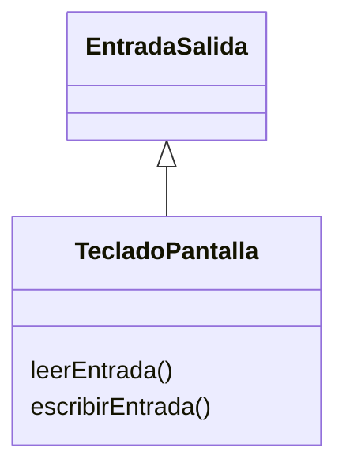

<!--
Posible prompt:
<prompt>
Tengo un cuestionario con preguntas sobre "Polimorfismo". Debes tener en cuenta que los conocimientos previos que tengo (y por tanto tus respuestas deben ser adaptadas), son:
- C/C++ sin orientación a objetos.
- Temas de Java previos: Clases y Objetos, Encapsulación, Excepciones, Composición y Herencia.

Cada respuesta debe tener entre 2 - 4 párrafos de longitud (sin contar los trozos de código).

Por favor, escribe en impersonal las respuestas.

</prompt>
----
-->
# Tema 5. Polimorfismo

## 1. Brevemente, ¿qué es el **"polimorfismo"** y para qué sirve en programación orientada a objetos? ¿qué es la **"sobreescritura"** de métodos?


**Polimorfismo** es un principio fundamental de la programación orientada a objetos (OOP) que permite que una misma referencia de tipo base pueda apuntar a objetos de diferentes subtipos y, al invocar métodos sobre esa referencia, se ejecute el comportamiento específico del objeto real al que apunta. Esto facilita la reutilización de código y la extensión de programas, ya que se pueden tratar objetos de distintas clases de manera uniforme.

>**El polimorfismo:**
 Se utiliza principalmente para diseñar sistemas flexibles y escalables, donde el código puede operar sobre colecciones de objetos de diferentes tipos derivados de una misma superclase, sin necesidad de conocer su tipo concreto en tiempo de compilación. Así, se puede escribir código más genérico y desacoplado.

La **sobreescritura** de métodos (`overriding`)
:  Ocurre cuando una subclase proporciona una implementación específica de un método que ya está definido en su superclase. 
>**Nota:** De este modo, al invocar ese método sobre una referencia del tipo base que apunta a un objeto de la subclase, se ejecuta la versión sobreescrita, permitiendo el comportamiento polimórfico.


## 2. ¿En qué consiste la **"ligadura dinámica"** o **"enlace tardío"**? ¿qué relación tiene con el polimorfismo? ¿hay que indicarlos explícitamente al programar o depende esto del lenguaje? Compara C++ y Java. Indicalo después también para Python.


**Ligadura dinámica** (o *enlace tardío*) es el mecanismo por el cual la decisión de qué implementación de un método se ejecuta se toma en tiempo de ejecución, y no en tiempo de compilación. Esto es esencial para el polimorfismo, ya que permite que, aunque una variable sea de tipo base, si apunta a un objeto de una subclase, se invoque el método correspondiente a la subclase.

>**En Java:**
La ligadura dinámica es automática para los métodos no estáticos ni privados: no es necesario indicar nada especial, basta con sobreescribir el método en la subclase.

>**En C++:**
Para conseguir polimorfismo real, es necesario declarar los métodos como `virtual` en la clase base. 

>**En Python:** 
Todos los métodos son polimórficos por defecto, ya que el lenguaje es dinámico y la resolución de métodos se hace siempre en tiempo de ejecución.

**Resumen comparativo:**

- **Java:** Ligadura dinámica por defecto para métodos de instancia.
- **C++:** Requiere palabra clave `virtual` para métodos polimórficos.
- **Python:** Siempre ligadura dinámica.


## 3. Pon un ejemplo sencillo en Java, de un `Soldado`, con un método `saluda`, con dos subclases: `Zapador` y `Artillero`, donde `Zapador` sobreescribe el método `saludar`, sustituyendo por completo su comportamiento. Ilustra el funcionamiento del polimorfismo creando un array de `Soldados` de dos tipos y luego recorriéndolo empleando referencias de tipo `Soldado` y llamando a `saludar`.


**Definición de clases:**

```java
class Soldado {
	void saluda() {
		System.out.println("¡A sus órdenes!");
	}
}

class Zapador extends Soldado {
	@Override
	void saluda() {
		System.out.println("¡Preparado para despejar el camino!");
	}
}

class Artillero extends Soldado {
	// No sobreescribe saluda, hereda el comportamiento base
}
```

**Uso del polimorfismo:**

```java
Soldado[] escuadron = { new Zapador(), new Artillero(), new Zapador() };
for (Soldado s : escuadron) {
	s.saluda(); // Se invoca el método correspondiente según el tipo real
}
```

>**Explicación:**
Al recorrer el array de `Soldado`, aunque la referencia es del tipo base, se ejecuta el método `saluda` de la subclase si está sobreescrito, demostrando el polimorfismo.


## 4. Si sobreescribo un método, ¿puedo invocar el método base para trabajar a partir de su resultado? Haz que zapador cambie ligeramente la forma de saludar, que salude de forma normal, tal cual hace el soldado base, pero que además añada un "ZAPADOR A SUS ORDENES" ¿qué palabra clave del lenguaje has usado para invocar al método de la clase base?


Sí, al sobreescribir un método en una subclase, es posible invocar la versión de la superclase utilizando la palabra clave `super`. Esto permite reutilizar el comportamiento original y ampliarlo o modificarlo según las necesidades de la subclase.

**Ejemplo:**

```java
class Zapador extends Soldado {
	@Override
	void saluda() {
		super.saluda(); // Invoca el método de la clase base
		System.out.println("ZAPADOR A SUS ORDENES");
	}
}
```

**Resumen:**

- Se utiliza `super.saluda();` para llamar al método de la clase base.
- Así, el zapador primero saluda como un soldado normal y luego añade su mensaje específico.


## 5. Al sobreescribir un método en Java, ¿qué restricciones existen sobre los tipos de los parámetros y el tipo de retorno? ¿Qué diferencia hay entre sobreescritura (*overriding*) y sobrecarga (*overloading*)? ¿Para qué sirve la anotación `@Override` y por qué es recomendable usarla siempre?


**Restricciones:**

- El método sobreescrito debe tener el mismo nombre, la misma lista de parámetros (mismo número y tipo), y el tipo de retorno debe ser igual o un subtipo (covariante) del método original.
- No se pueden reducir los niveles de visibilidad (por ejemplo, de `public` a `protected`).
- No se pueden lanzar nuevas excepciones comprobadas que no estén declaradas en el método base.

**Diferencias:**

- **Sobreescritura (overriding):** Una subclase redefine un método de la superclase con la misma firma para cambiar o ampliar su comportamiento.
- **Sobrecarga (overloading):** En la misma clase (o subclase), existen varios métodos con el mismo nombre pero distinta lista de parámetros.

**@Override:**

- Es una anotación que indica explícitamente que un método está sobrescribiendo uno de la superclase.
- Es recomendable usarla siempre porque el compilador verifica que realmente se está sobrescribiendo un método existente, ayudando a evitar errores por diferencias en la firma.


## 6. Entonces, cuando se estudia Java, ¿se emplea el polimorfismo desde el principio? Por ejemplo, sobreescribiendo `toString` o sobreescribiendo `equals`, ¿ya estoy usando polimorfismo?


Sí, el polimorfismo se emplea desde las primeras etapas del aprendizaje de Java, incluso aunque no se sea plenamente consciente de ello. Cuando se sobreescriben métodos como `toString`, `equals` o `hashCode`, se está utilizando polimorfismo, ya que estos métodos se definen en la clase base `Object` y se invocan de forma polimórfica sobre cualquier objeto.

>**Ejemplo:**
Al imprimir un objeto con `System.out.println(obj)`, Java invoca automáticamente el método `toString` correspondiente al tipo real del objeto, aunque la referencia sea de tipo `Object` o de una superclase. Esto es polimorfismo en acción.

Por tanto, la sobreescritura de métodos heredados es una de las formas más habituales y tempranas de aplicar el polimorfismo en Java.


## 7. ¿Qué es una **"clase abstracta"**? ¿Qué es un **"método abstracto"**? ¿Puedo crear instancias de una clase abstracta? Pongamos un ejemplo en Java: Redefinamos `Soldado`, hagamos que, además del método `saluda` que ya tenía, tenga un método `atacar`, que sea abstracto y que cada tipo de soldado haga su acción cuando se le pida atacar. ¿Donde debemos poner `abstract`?


**Definiciones:**

- Una **clase abstracta** es una clase que no puede ser instanciada directamente y que puede contener métodos abstractos (sin implementación) y métodos concretos (con implementación).
- Un **método abstracto** es aquel que se declara sin cuerpo, obligando a las subclases a proporcionar su propia implementación.

No se pueden crear instancias de una clase abstracta. Sirve como plantilla para otras clases.

**Ejemplo:**

```java
abstract class Soldado {
	void saluda() {
		System.out.println("¡A sus órdenes!");
	}
	abstract void atacar(); // Método abstracto
}
```
```java
class Zapador extends Soldado {
	@Override
	void atacar() {
		System.out.println("Zapador despejando minas");
	}
}
```
```java
class Artillero extends Soldado {
	@Override
	void atacar() {
		System.out.println("Artillero disparando cañón");
	}
}
```

**¿Dónde poner `abstract`?**

- Se coloca `abstract` delante de la clase y de los métodos que no tienen implementación.


## 8. ¿Qué efecto tiene la palabra clave `final` sobre métodos y clases en Java? ¿Cómo se relaciona con el polimorfismo? ¿Conoces algún ejemplo de clase `final` en la propia API estándar de Java?


La palabra clave `final` en Java tiene los siguientes efectos:

- **En métodos:** Impide que el método sea sobrescrito en las subclases. Esto limita el polimorfismo, ya que no se puede modificar el comportamiento del método en clases derivadas.
- **En clases:** Impide que la clase sea extendida. No se pueden crear subclases, por lo que no se puede aplicar herencia ni polimorfismo sobre esa clase.

**Relación con polimorfismo:**

El uso de `final` restringe el polimorfismo, ya que impide la extensión y la redefinición de comportamientos.

**Ejemplo en la API estándar:**

- La clase `String` es un ejemplo de clase `final` en Java. No se puede heredar de `String`.


## 9. En Java, qué son las **"interfaces"**? ¿Son como clases abstractas? ¿Una clase puede implementar más de una interfaz?


Interfaces
: Son tipos de referencia que definen un conjunto de métodos abstractos (y, desde Java 8, métodos con implementación por defecto). 
* No pueden tener estado (atributos con valor), salvo constantes.

Las interfaces son **similares a las clases abstractas** en que no se pueden instanciar y pueden definir métodos que deben ser implementados por las clases que las implementan. 

Sin embargo, **una clase puede implementar varias interfaces**, mientras que solo puede extender una clase (abstracta o no).
#### Ejemplo
```java
public interface EntradaSalida {
    public String leerEntrada();
    public void escribirEnSalida(String salida);
}
```
```java
public class TecladoPantalla implements EntradaSalida {
    // ...
}
```


**Resumen:**

- Una clase puede implementar más de una interfaz, lo que permite simular herencia múltiple de comportamiento.
- Las interfaces definen "qué se debe hacer", pero no "cómo".
>**Nota:**
Para implementar más de una interfaz sería, por ejemplo:
`public class ... implements interfaz1, interfaz2`


## 10. Vamos a poner un ejemplo nuevo con polimorfismo. Queremos implementar una clase `Punto`, con un método `calcularDistanciaA`, que permite calcular la distancia a otro `Punto`. Sin embargo, como queremos trabajar con puntos 2D y 3D, haz que ese método sea abstracto y haya dos implementaciones de ese cálculo de distancia. Emplea `instanceof` y *downcasting* para verificar que se recibe un punto compatible y poder calcular correctamente la distancia siempre entre puntos del mismo subtipo. Aprovecha este diseño para crear ahora una clase `Linea`, que acepta `Punto`, sin saber de qué tipo es, y es capaz de dar su longitud independientemente de las dimensiones de sus puntos (las cuales desconoce).


**Definición de clases:**

```java
public abstract class Punto {
	abstract double calcularDistanciaA(Punto otro);
}
```
```java
public class Punto2D extends Punto {
    double x, y;
    Punto2D(double x, double y) { 
        this.x = x; this.y = y;
    }
    @Override
    double calcularDistanciaA(Punto otro) {
        if (otro instanceof Punto2D) {
    		Punto2D p = (Punto2D) otro;
    		return Math.sqrt(Math.pow(x - p.x, 2) + Math.pow(y - p.y, 2));
        }
        throw new IllegalArgumentException("Tipo incompatible");
    }
}
```
```java
public class Punto3D extends Punto {
	double x, y, z;
	Punto3D(double x, double y, double z) { this.x = x; this.y = y; this.z = z; }
	@Override
	double calcularDistanciaA(Punto otro) {
		if (otro instanceof Punto3D) {
			Punto3D p = (Punto3D) otro;
			return Math.sqrt(Math.pow(x - p.x, 2) + Math.pow(y - p.y, 2) + Math.pow(z - p.z, 2));
		}
		throw new IllegalArgumentException("Tipo incompatible");
	}
}
```
```java
public class Linea {
    private Punto a;
    private Punto b;

    public Linea(Punto a, Punto b) {
        this.a = a; this.b = b;
    }

    public double longitud() {
        return a.calcularDistanciaA(b);
    }
}
```

**Explicación:**

- Se usa polimorfismo para que `Linea` funcione con cualquier tipo de `Punto`.
- Se emplea `instanceof` y *downcasting* para asegurar que los puntos sean del mismo tipo antes de calcular la distancia.


## 11. ¿Qué es la **"herencia de interfaces"** en Java? ¿Existe **"herencia múltiple de interfaces"**? Pon un ejemplo de una interfaz `Fichero` que tenga un método para leer su contenido en forma de `String` y luego dicha interfaz sea extendida por otra que sea `FicheroEscribible` que permita enviar contenido e incluso eliminar el fichero.

### Respuesta

**Herencia de interfaces** en Java consiste en que una interfaz puede extender (heredar) de otra, añadiendo nuevos métodos. Java permite herencia múltiple de interfaces, es decir, una interfaz puede extender varias interfaces a la vez.

**Ejemplo:**

```java
interface Fichero {
	String leer();
}

interface FicheroEscribible extends Fichero {
	void escribir(String contenido);
	void eliminar();
}
```

**Resumen:**

- Una interfaz puede extender varias interfaces, combinando sus métodos.
- Esto permite diseñar jerarquías flexibles y reutilizables de comportamiento.
