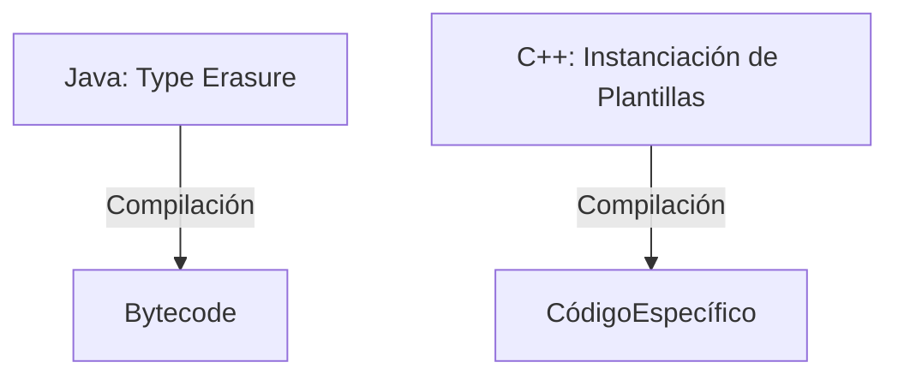
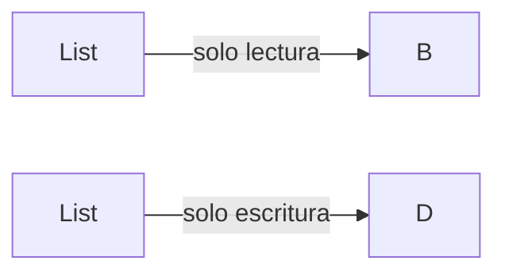

<!--
Posible prompt:
<prompt>
Tengo un cuestionario con preguntas sobre "Genericidad". Debes tener en cuenta que los conocimientos previos que tengo (y por tanto tus respuestas deben ser adaptadas), son:
- C/C++ sin orientación a objetos.
- Temas de Java previos: clases y objetos, encapsulación, excepciones, composición, herencia y polimorfismo.

Cada respuesta debe tener entre 2 - 4 párrafos de longitud (sin contar los trozos de código).

Por favor, escribe en impersonal las respuestas.

</prompt>
----
-->
# TEMA 6. Genericidad

## 1. Empleando `void*` en C o `Object` en Java, pon un ejemplo de una estructura de datos, que empleando un array primitivo, permita alojar cualquier tipo de dato.


**En C:**
Se puede crear una estructura que almacene punteros `void*`, permitiendo guardar cualquier tipo de dato, aunque se pierde el control de tipo en tiempo de compilación.

```c
#define MAX 10
typedef struct {
    void* datos[MAX];
    int tam;
} ArrayGenerico;

// Ejemplo de uso:
int x = 5;
double y = 3.14;
ArrayGenerico arr;
arr.datos[0] = &x;
arr.datos[1] = &y;
arr.tam = 2;
```

**En Java:**
Se puede usar un array de `Object`, ya que todas las clases heredan de `Object`.

```java
Object[] datos = new Object[10];
datos[0] = "Hola";
datos[1] = 42;
datos[2] = 3.14;
```

> **Nota:** En ambos casos, se puede almacenar cualquier tipo, pero al recuperar el dato es necesario hacer un *cast* al tipo original.

## 2. Brevemente, ¿Qué significa la **programación genérica**? ¿Es el ejemplo anterior un ejemplo básico de programación genérica? 


**Definición:**
La programación genérica es un paradigma que permite escribir código (clases, funciones, métodos) que puede trabajar con cualquier tipo de dato, sin especificar explícitamente el tipo concreto. Se basa en el uso de parámetros de tipo, que se sustituyen por tipos reales al usar la clase o función.

**¿Es el ejemplo anterior programación genérica?**
El ejemplo anterior (usar `void*` en C o `Object` en Java) es una forma básica de simular genericidad, pero no es programación genérica en sentido estricto. No hay comprobación de tipos en tiempo de compilación, y se requiere *downcasting* al recuperar los datos, lo que puede provocar errores en tiempo de ejecución.

> **Resumen:** La verdadera programación genérica proporciona seguridad de tipos en tiempo de compilación, cosa que no ocurre usando solo `void*` o `Object`.

## 3. Indica los problemas respecto al chequeo de tipos, de emplear `void*` o `Object` cuando se crean estructuras de datos genéricas. 


**Problemas principales:**

- **Falta de seguridad de tipos:** Al almacenar datos como `void*` o `Object`, el compilador no puede comprobar si el tipo recuperado es el correcto. Esto puede llevar a errores difíciles de detectar.
- **Necesidad de *downcasting*:** Al recuperar un elemento, es necesario convertirlo explícitamente al tipo original. Si el tipo no coincide, se produce un error en tiempo de ejecución (por ejemplo, `ClassCastException` en Java).
- **Menor legibilidad y mantenibilidad:** El código es menos claro, ya que no se sabe qué tipo de datos se espera en cada posición del array.

> **Ejemplo en Java:**
```java
Object obj = datos[0];
String s = (String) obj; // Si obj no es String, lanza excepción
```


## 4. Vamos entonces con mecanismos de mejora de la programación genérica ¿Qué son los **parámetros de tipo**? 


**Definición:**
Los parámetros de tipo son variables que representan tipos de datos y se usan para definir clases, interfaces o métodos genéricos. Permiten que el código sea reutilizable y seguro, ya que el tipo concreto se especifica al instanciar la clase o llamar al método.

**Ejemplo en Java:**
```java
class Caja<T> {
    private T valor;
    public Caja(T valor) { this.valor = valor; }
    public T getValor() { return valor; }
}
```
Al crear una `Caja<Integer>`, el parámetro de tipo `T` se sustituye por `Integer`.

> **Ventaja:** El compilador puede comprobar que solo se almacenan y recuperan datos del tipo correcto, evitando errores de tipo.


## 5. En Java existe "generics", en C++ existen "templates". Pon un ejemplo de uso de programación genérica en ambos, instanciando una lista o vector dinámico que solo admite `String`. Introduce valores, y luego haz un recorrido de ellos mostrando cómo cada elemento es del tipo concreto con seguridad.


**Java (Generics):**
```java
import java.util.ArrayList;
ArrayList<String> lista = new ArrayList<>();
lista.add("uno");
lista.add("dos");
for (String s : lista) {
    System.out.println(s.toUpperCase()); // Seguridad de tipo
}
```

**C++ (Templates):**
```cpp
#include <vector>
#include <string>
#include <iostream>
std::vector<std::string> lista;
lista.push_back("uno");
lista.push_back("dos");
for (const std::string& s : lista) {
    std::cout << s << std::endl;
}
```

> **Ambos ejemplos** muestran cómo la genericidad permite trabajar con tipos concretos (`String`), garantizando la seguridad de tipos en tiempo de compilación.


## 6. Sobre el funcionamiento de la programación genérica. ¿Qué hace el compilador cuando se instancia una clase que tiene parámetros de tipo? ¿Hace lo mismo C++ y Java? ¿Qué es el "type erasure" de Java y la "instanciación de plantillas" de C++?


**Java:**
El compilador realiza *type erasure* (borrado de tipos): elimina la información de los parámetros de tipo en tiempo de compilación y reemplaza los tipos genéricos por `Object` (o el límite superior). Así, en tiempo de ejecución, no existe información sobre el tipo genérico.

**C++:**
El compilador genera una versión específica del código para cada tipo concreto usado (instanciación de plantillas). Por ejemplo, si se usa `Vector<int>` y `Vector<double>`, se generan dos clases distintas en el binario.

**Resumen visual:**


> **Diferencia clave:** En Java, todos los objetos genéricos son del mismo tipo en tiempo de ejecución; en C++, cada tipo concreto genera código diferente.


## 7. Vamos a crear una nueva clase con parámetros de tipo. Define en Java una clase `Par`, que permite alojar dos valores de tipos diferentes. Incluye un constructor y un getter para cada tipo. Pon un ejemplo de uso de ese `Par`, por ejemplo para especificar el tipo de retorno de una función que devuelve en un `Par` la media y desviación típica de un array de `double`. 


**Definición de la clase `Par`:**
```java
public class Par<A, B> {
    private final A primero;
    private final B segundo;
    public Par(A primero, B segundo) {
        this.primero = primero;
        this.segundo = segundo;
    }
    public A getPrimero() { return primero; }
    public B getSegundo() { return segundo; }
}
```

**Ejemplo de uso:**
```java
public static Par<Double, Double> calcularMediaYDesviacion(double[] datos) {
    double suma = 0;
    for (double d : datos) suma += d;
    double media = suma / datos.length;
    double sumaCuadrados = 0;
    for (double d : datos) sumaCuadrados += Math.pow(d - media, 2);
    double desviacion = Math.sqrt(sumaCuadrados / datos.length);
    return new Par<>(media, desviacion);
}
```

> **Ventaja:** Permite devolver dos valores de tipos distintos de forma segura y clara.


## 8. En Java, se pueden declarar parámetros de tipo también a nivel de método, no solo a nivel de clase. Pon un ejemplo con un método genérico `seleccionaUno`, que pasados dos objetos del mismo tipo, te devuelva aleatoriamente uno de ellos. Muestra la diferencia de definirlo con dos `Object`, a definirlo con dos parámetros de tipo, en terminos de (i) evitar downcasting y (ii) forzar que ambos objetos sean del mismo tipo. 


**Versión usando `Object`:**
```java
public static Object seleccionaUno(Object a, Object b) {
    return Math.random() < 0.5 ? a : b;
}
// Uso:
String s = (String) seleccionaUno("hola", "adios"); // Necesita downcasting
```

**Versión genérica:**
```java
public static <T> T seleccionaUno(T a, T b) {
    return Math.random() < 0.5 ? a : b;
}
// Uso:
String s = seleccionaUno("hola", "adios"); // No necesita downcasting
```

**Diferencias:**
- Con generics, el compilador fuerza que ambos argumentos sean del mismo tipo y no es necesario hacer *downcasting*.
- Usando `Object`, se puede pasar cualquier tipo y se pierde la seguridad de tipos.


## 9. ¿Se pueden establecer restricciones en los parámetros de tipo? Por ejemplo, si quiero definir un tipo genérico `<T>`, ¿puedo decir que tenga que ser, al menos, un número para poder tratarlo como tal? Pon un ejemplo en Java de un `Punto` con dos coordenadas, metodos `getX`, `getY`, y una función `calcularDistanciaA` otro `Punto`. Permite que esas coordenadas sean cualquier tipo de número. Pon dos soluciones: una simplemente creando coordenadas de tipo `Number` y otra añadiendo generics para reforzar el chequeo de tipos y saber exactamente con qué tipo de número trabaja el `Punto`. En este caso y respecto al "type erasure", ¿cuál es el tipo final tras la compilación?


**Restricciones en parámetros de tipo:**
En Java, se pueden establecer límites usando `extends`. Por ejemplo, `<T extends Number>` obliga a que el tipo sea un subtipo de `Number`.

**Solución 1: Coordenadas de tipo `Number`**
```java
public class Punto {
    private final Number x, y;
    public Punto(Number x, Number y) { this.x = x; this.y = y; }
    public Number getX() { return x; }
    public Number getY() { return y; }
    public double calcularDistanciaA(Punto otro) {
        double dx = x.doubleValue() - otro.x.doubleValue();
        double dy = y.doubleValue() - otro.y.doubleValue();
        return Math.sqrt(dx*dx + dy*dy);
    }
}
```

**Solución 2: Usando generics**
```java
public class Punto<T extends Number> {
    private final T x, y;
    public Punto(T x, T y) { this.x = x; this.y = y; }
    public T getX() { return x; }
    public T getY() { return y; }
    public double calcularDistanciaA(Punto<T> otro) {
        double dx = x.doubleValue() - otro.x.doubleValue();
        double dy = y.doubleValue() - otro.y.doubleValue();
        return Math.sqrt(dx*dx + dy*dy);
    }
}
```

**Type erasure:**
En ambos casos, tras la compilación, el tipo genérico se borra y solo queda `Number` como tipo real en tiempo de ejecución.


## 10. Sobre las soluciones anteriores. Si bien ambas permiten trabajar con distintos tipos de número sin duplicar la clase `Punto`, reflexiona sobre el refuerzo del chequeo de tipos con generics. ¿Permiten ambas crear un punto con una coordenada de tipo entero y la otra coordenada de tipo real? ¿Qué tipo devuelve el `getX` con la solucion sin generics y qué tipo devuelve el que tiene la solución con generics?


**Chequeo de tipos:**
- La versión sin generics (`Number`) permite mezclar cualquier tipo de número en cada coordenada (por ejemplo, `x` entero y `y` real).
- La versión con generics (`<T extends Number>`) fuerza que ambas coordenadas sean del mismo tipo, reforzando la seguridad de tipos.

**Tipo devuelto por `getX`:**
- Sin generics: `getX()` devuelve `Number`.
- Con generics: `getX()` devuelve el tipo concreto `T` (por ejemplo, `Integer` o `Double`).

> **Resumen:** El uso de generics refuerza el chequeo de tipos y hace el código más seguro y expresivo.


## 11. Hagamos un ejemplo avanzado. El siguiente código, con interfaz `Punto`, que define un método `calcularDistanciaA(Punto p)`, junto con las implementaciones `Punto2D` y `Punto3D`. Añade generics para asegurarnos que la sobreescritura del método calcular distancia a otro `Punto` siempre es sobre un `Punto` del mismo tipo, evitando `instanceof` y el downcasting.
```java
public interface Punto { 
    public double distanciaA(Punto p); 
} 

public class Punto2D implements Punto { 
     private final double x, y; 
     public Punto2D(double x, double y) { 
        this.x = x; this.y = y; 
    } 

    @Override 
    public double distanciaA(Punto p) { 
        if (p instanceof Punto2D) { 
            Punto2D p2d = (Punto2D) p; 
            return Math.sqrt(Math.pow(x - p2d.x, 2) 
                    + Math.pow(y - p2d.y, 2)); 
        } else { 
            throw new RuntimeException("p debe ser Punto 2D"); 
        } 
    } 
} 
public class Punto3D implements Punto { 
    // Igual que Punto2D, pero con tres coordenadas
    ...
} 
```
---

**Solución usando generics y el patrón *self-referential generic* (F-bounded polymorphism):**
```java
public interface Punto<T extends Punto<T>> {
    double distanciaA(T otro);
}

public class Punto2D implements Punto<Punto2D> {
    private final double x, y;
    public Punto2D(double x, double y) { this.x = x; this.y = y; }
    @Override
    public double distanciaA(Punto2D otro) {
        return Math.sqrt(Math.pow(x - otro.x, 2) + Math.pow(y - otro.y, 2));
    }
}

public class Punto3D implements Punto<Punto3D> {
    private final double x, y, z;
    public Punto3D(double x, double y, double z) { this.x = x; this.y = y; this.z = z; }
    @Override
    public double distanciaA(Punto3D otro) {
        return Math.sqrt(Math.pow(x - otro.x, 2) + Math.pow(y - otro.y, 2) + Math.pow(z - otro.z, 2));
    }
}
```

> **Ventaja:** Se evita el uso de `instanceof` y *downcasting*, asegurando en tiempo de compilación que solo se comparan puntos del mismo tipo.


## 12. Dado que `String` es subtipo de `Object`, ¿significa eso que `List<String>` es subtipo de `List<Object>`? ¿Y que `String[]` es subtipo de `Object[]`? Razona por qué la respuesta es diferente en cada caso y qué problema en tiempo de ejecución puede aparecer con los arrays. A partir de estos ejemplos, define qué significa que un tipo genérico sea **covariante**, **contravariante** o **invariante** respecto a su parámetro de tipo.

### Respuesta

**Arrays:**
En Java, `String[]` **sí** es subtipo de `Object[]` (covarianza de arrays). Esto permite hacer:
```java
Object[] arr = new String[10];
arr[0] = 42; // Error en tiempo de ejecución: ArrayStoreException
```

**Generics:**
`List<String>` **NO** es subtipo de `List<Object>` (los genéricos en Java son invariantes). No se puede asignar una lista de `String` a una variable de tipo `List<Object>`.

**Definiciones:**
- **Covariante:** El tipo genérico acepta subtipos de su parámetro (`String[]` es subtipo de `Object[]`).
- **Contravariante:** El tipo genérico acepta supertipos de su parámetro.
- **Invariante:** No hay relación de subtipado entre diferentes instanciaciones (`List<String>` y `List<Object>` son tipos independientes).

> **Problema de los arrays:** La covarianza de arrays puede provocar errores en tiempo de ejecución, mientras que la invariancia de los genéricos evita estos problemas en tiempo de compilación.


## 13. Java permite recuperar covarianza y contravarianza en tipos genéricos de forma controlada mediante **wildcards**. ¿Qué es un wildcard (`?`)? Muestra la diferencia entre `List<? extends T>` y `List<? super T>`, indicando en qué casos se usa cada uno. Pon dos ejemplos: (i) un método que reciba una lista de números y calcule su suma, usando `? extends`; (ii) un método que reciba una lista y le añada varios números enteros, usando `? super`.

### Respuesta

**Wildcard (`?`):**
Es un comodín que representa un tipo desconocido. Permite especificar relaciones de subtipado en genéricos.

- `List<? extends T>`: Lista de algún subtipo de `T` (covariante). Se usa cuando solo se va a leer de la lista.
- `List<? super T>`: Lista de algún supertipo de `T` (contravariante). Se usa cuando solo se va a escribir en la lista.

**Ejemplo 1: Sumar una lista de números (`? extends Number`)**
```java
public static double suma(List<? extends Number> lista) {
    double total = 0;
    for (Number n : lista) total += n.doubleValue();
    return total;
}
```

**Ejemplo 2: Añadir enteros a una lista (`? super Integer`)**
```java
public static void añadeEnteros(List<? super Integer> lista) {
    lista.add(1);
    lista.add(2);
}
```

> **Resumen visual:**

